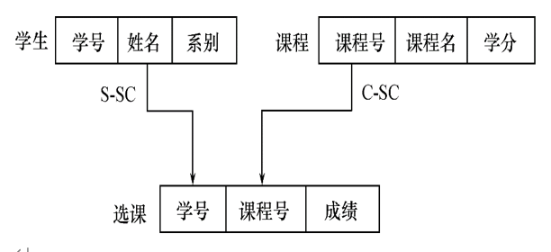
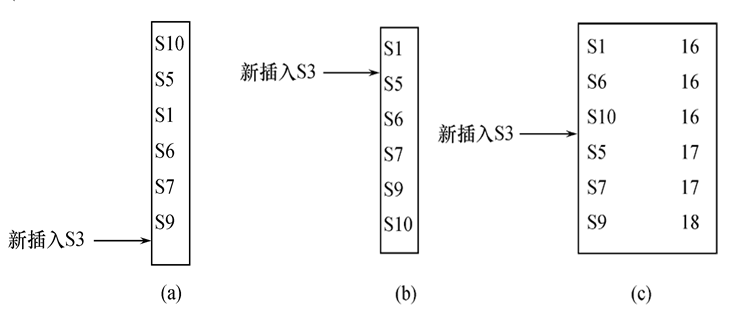

# 绪论
## 数据库系统概述
### 四个基本概念
#### 数据（Data）

1. 数据（Data）是数据库中存储的基本对象
2. 数据的定义：描述事物的符号记录
3. 数据的种类：文本、图形、图像、音频、视频等
4. 数据的特点：数据与其语义是不可分的
   
#### 数据库（Database）

1. 数据库的定义：
数据库（Database，简称DB）是长期存储在计算机内、有组织的、可共享的大量数据的集合。
2. 数据库的基本特征
    * 数据按一定的数据模型组织、描述和储存
    * 可为各种用户共享
    * 冗余度较小
    * 数据独立性较高
    * 易扩展
  
#### 数据库管理系统（DBMS）

1. 概念
    * 位于用户与操作系统之间的一层数据管理软件
    * 是基础软件，是一个大型复杂的软件系统
2. 用途
    * 科学地组织和存储数据、高效地获取和维护数据
3. 功能
  * 数据定义功能
    * 提供数据定义语言（DDL） 
    * 定义数据库中的数据对象
   * 数据组织、存储和管理
     * 分类组织、存储和管理各种数据
     * 确定组织数据的文件结构和存取方式
     * 实现数据之间的联系
     * 提供多种存取方法提高存取效率
  * 数据操纵功能
    * 提供数据操纵语言（DML）
    * 实现对数据库的基本操作（查询、插入、删除和修改）
  * 数据库的事务管理和运行管理
    * 数据库在建立、运行和维护时由DBMS统一管理和控制
    * 保证数据的安全性、完整性、多用户对数据的并发使用
    * 发生故障后的系统恢复
  * 数据库的建立和维护功能(实用程序)
    * 数据库初始数据装载转换
    * 数据库转储
    * 介质故障恢复
    * 数据库的重组织
    * 性能监视分析等
  * 其他功能
    * DBMS与网络中其它软件系统的通信
    * 两个DBMS系统的数据转换
    * 异构数据库之间的互访和互操作

#### 数据库系统（DBS）

1. 概念
在计算机系统中引入数据库后的系统构成
2. 数据库系统的构成
    * 数据库
    * 数据库管理系统（及其开发工具）
    * 应用系统
    * 数据库管理员
  
### 数据管理技术的产生和发展

1. 数据管理的概念
    * 对数据进行分类、组织、编码、存储、检索和维护
    * 数据处理的中心问题
2. 数据管理技术的发展过程
  * 人工管理阶段
  * 文件系统阶段
  * 数据库系统阶段
     * 时期
  20世纪60年代以来
    * 产生的背景
      * 应用背景   —— 大规模管理
      * 硬件背景 —— 大容量磁盘、磁盘阵列
      * 软件背景 —— 有数据库管理系统
      * 处理方式 —— 联机实时处理，分布处理，批处理
  
### 数据库系统的特点

1. 数据结构化
  * **整体数据的结构化**是数据库的主要特征之一
  * 整体结构化
  * 数据库中实现的是数据的真正结构化
    * 数据的结构用**数据模型**描述，无需程序定义和解释
    * 数据可以**变长**
    * 数据的最小存取单位是**数据项**
2. 数据的共享性高，冗余度低，易扩充
数据库系统从整体角度看待和描述数据，数据面向整个系统，可以被多个用户、多个应用共享使用。

3. 数据独立性高
  * 物理独立性
  指用户的应用程序与存储在磁盘上的数据库中数据是相互独立的。当数据的物理存储改变了，应用程序不用改变。
  * 逻辑独立性
  指用户的应用程序与数据库的逻辑结构是相互独立的。数据的逻辑结构改变了，用户程序也可以不变
  * 数据独立性是由DBMS的二级映像功能来保证的
4. 数据由DBMS统一管理和控制

## 数据模型
### 两大类数据模型
1. 在数据库中用数据模型这个工具来**抽象**、**表示**和**处理**现实世界中的数据和信息。
2. 通俗地讲数据模型就是**现实世界的模拟**
3. 数据模型应满足三方面要求
   * 能比较**真实**地模拟现实世界
   * **容易**为人做**理解**
   * 便于在计算机上实现
4. 数据模型分为两类（分属两个不同的层次）
   1. **概念模型**，也称信息模型，它是按用户的观点来对数据和信息建模，用于数据库设计。
   2. **逻辑模型和物理模型**
    * 逻辑模型主要包括网状模型、层次模型、关系模型、面向对象模型等，按计算机系统的观点对数据建模，用于DBMS实现
    * 物理模型是对数据最底层的抽象，描述数据在系统内部的表示方式和存取方法，在磁盘或磁带上的存储方式和存取方法。
5. 客观对象的抽象过程——**两步抽象**
    * 现实世界中的客观对象抽象为概念模型
    * 把概念模型转换为某一DBMS支持的数据模型
  
### 数据模型的组成要素
#### 数据结构

1. 数据结构的概念
描述数据库的组成对象，以及对象之间的联系
2. 描述的内容
  * 与数据烈性、内容、性质有关的对象
  * 与数据之间联系有关的对象
3. 数据结构是对系统静态特性的描述

#### 数据操作

1. 数据操作
对数据库中各种对象(型)的实例(值)允许执行的**操作**及有关的**操作规则**
2. 数据操作的类型
  * 查询
  * 更新（包括插入、删除、修改）
3. 数据模型对操作的定义
4. 数据操作是对系统动态特性的描述

#### 完整性约束条件

1. 数据的完整性约束条件
  * 一组完整性规则的集合。
  * 完整性规则：给定的数据模型中数据及其联系所具有的制约和储存规则
  * 用以限定符合数据模型的数据库状态以及状态的变化，以保证数据的正确、有效、相容。
2. 数据模型对完整性约束条件的定义
  * 反映和规定本**数据模型**必须遵守的**基本的通用的**完整性约束条件。例如在关系模型中，任何关系必须满足实体完整性和参照完整性两个条件。
  * 提供定义完整性约束条件的机制，以反映**具体应用**所涉及的数据必须遵守的特定的语义约束条件。

### 概念模型

1. 概念模型的用途
  * 概念模型用于信息世界的建模
  * 是现实世界到机器世界的一个中间层次
  * 是数据库设计的有力工具
  * 数据库设计人员和用户之间进行交流的语言

#### 信息世界中的基本概念

1. 实体（Entity）
客观存在并可相互区别的事物称为实体。
可以是具体的人、事、物或抽象的概念。
2. 属性（Attribute）
实体所具有的某一特性称为属性。
一个实体可以由若干个属性来刻画。  
3. 码（Key）
   唯一标识实体的属性集称为码。
4. 域（Domain）
属性的取值范围称为该属性的域。 
5. 实体型（Entity Type）
用实体名及其属性名集合来抽象和刻画同类实体称为实体型。
6. 实体集（Entity Set）
同一类型实体的集合称为实体集
7. 联系（Relationship）
  * 现实世界中事物内部以及事物之间的联系在信息世界中反映为实体内部的联系和实体之间的联系。
  * **实体内部**的联系通常是指组成实体的各属性之间的联系
  * **实体之间**的联系通常是指不同实体集之间的联系
  
#### 两个实体型之间的联系

1. 一对一联系（1：1）
  * 实例：一个班级只有一个正班长
  * 定义：如果对于实体集A中的每一个实体，实体集B中至多一个（也可以没有）实体与之联系，反之亦然，**则称实体集A与实体集B具有一对一联系**，记为1：1
2. 一对多联系（1：n）
   * 实例：一个班级中有若干个学生；每个学生只在一个班级中学习。
   * 定义：如果对于实体集A中的每一个实体，实体集B中有n个实体（n≥0）与之联系，反之，对于实体集B中的每一个实体，实体集A中至多只有一个实体与之联系，则称**实体集A与实体集B**有一对多联系，记为1:n
3. 多对多联系（m：n）
   * 实例：课程与学生之间的联系：一门课程同时有若干个学生选修；一个学生可以同时选修多门课程
   * 定义：如果对于实体集A中的每一个实体，实体集B中有n个实体（n≥0）与之联系，反之，对于实体集B中的每一个实体，实体集A中也有m个实
体（m≥0）与之联系，则称实体集A与实体B具有多对多联系，记为m:n

#### 两个以上实体型之间的联系

1. 两个以上实体型之间一对多联系
  * 定义:实体型E1，E2，...，Ek，(1)对于实体型Ej（j=1，2，...，i-1，i+1，...，n）中的给定实体，最多只和Ei中的一个实体相联系；(2)对于Ei中的一个实体, 和Ej中的n(n>=0)个实体相联系；则我们说Ei与E1，E2，...，Ei-1，Ei+1，...，Ek之间的联系是一对多的
  * 实例：课程、教师与参考书三个实体型。一门课程可以有若干个教师讲授，使用若干本参考书;每一个教师只讲授一门课程;每一本参考书只供一门课程使用
2.  两个以上实体型之间一对一联系
  * 定义:若实体型E1，E2，...，Ek，(1)对于实体型Ej（j=1，2，...，i-1，i+1，...，n）中的给定实体，最多只和Ei中的一个实体相联系；(2)对于实体型Ei中的给定实体，和Ej中的n个(n>=0)实体相联系，则我们说Ei与E1，E2，...，Ei-1，Ei+1，...，Ek之间的联系是一对多的。
  * 实例：班级、班长与班主任三个实体型。一个班级有且只有一个班长，有且只有一个班主任;一个班长只管一个班级;一个班主任只管一个班级。
3.  两个以上实体型之间多对多联系
  * 定义:实体型E1，E2，...，Ek，(1)对于实体型Ej（j=1，2，...，i-1，i+1，...，k）中的给定实体，和Ei中的n(n>=0)个实体相联系；(2)对于实体型Ei中的给定实体，和Ei中的m(m>=0)个实体相联系；则我们说Ei与E1，E2，...，Ei-1，Ei+1，...，Ek之间的联系是多对多的
  * 实例：供应商、项目、零件三个实体型。一个供应商可以供给多个项目多种零件；每个项目可以使用多个供应商供应的零件；每种零件可由不同供应商供给。

#### 单个实体型内的联系

1. 同一实体集内的各实体之间的关系
  * 一对多联系；例如职工实体型内部具有领导与被领导的联系。
  * 一对一联系；职工实体型内部具有配偶的联系。
  * 多对多联系；零件实体型内部具有构成的联系。
  
#### 概念模型的一种表示方法

1. 实体——联系方法（E-R方法）
  * 用E-R图来描述现实世界的概念模型
  * E-R方法也称为E-R模型
2. E-R图
  * 实体型：用矩形表示，矩形框内写明实体名。
  * 属性：用椭圆形表示，并用无向边将其与相应的实体连接起来
  * 联系：用菱形表示，菱形框内写明联系名，并用无向边分别与有关实体连接起来，同时在无向边旁标上联系的类型（1:1、1:n或m:n）
3. 联系的属性：联系本身也是一种实体型，也可以有属性。如果一个联系具有属性，则这些属性也要用无向边与该联系连接起来 


### 最常用的数据模型

1. 非关系模型
 - 层次模型(Hierarchical Model)
 - 网状模型(Network Model)
2. 关系模型(Relational Model)  
3. 面向对象模型(Object Oriented Model）
4. 对象关系模型(Object Relational Model)

### 层次模型


层次模型是数据库系统中最早出现的数据模型,用**树形结构**来表示各类实体以及实体间的联系。

#### 层次数据模型的数据结构

满足下面两个条件的基本层次联系的集合为层次模型：
 1. 有且只有一个结点没有双亲结点，这个结点称为根结点
 2. 根以外的其它结点有且只有一个双亲结点

图\@ref(fig:fig16)是一个层次模型的实例。图\@ref(fig:fig17)是教员学生层次数据库模型。图\@ref(fig:fig18)是教员学生层次数据库的一个值 。
<div class="figure" style="text-align: center">

<p class="caption">(\#fig:fig16)一个层次模型的示例</p>
</div>
层次模型的特点

 * 结点的双亲是唯一的
 * 只能直接处理一对多的实体联系
 * 每个记录类型可以定义一个排序字段，也称为码字段
 * 任何记录值只有按其路径查看时，才能显出它的全部意义
 * 没有一个子女记录值能够脱离双亲记录值而独立存在


<div class="figure" style="text-align: center">

<p class="caption">(\#fig:fig17)教员学生层次数据库模型</p>
</div>
<div class="figure" style="text-align: center">

<p class="caption">(\#fig:fig18)教员学生层次数据库模型</p>
</div>

#### 多对多联系在层次模型中的表示
层次模型中，将多对多联系分解成一对多联系来间接表示多对多联系。分解方法有冗余结点
法和虚拟结点法。

#### 层次模型的数据操纵与完整性约束 
层次模型的数据操纵：查询、插入、删除、更新
层次模型的完整性约束条件：

 - 无相应的双亲结点值就不能插入子女节点值
 - 如果删除双亲结点值，则相应的子女节点值也被同时删除
 - 更新操作时，应更新所有相应记录，以保证数据的一致性

#### 层次数据模型的存储结构

1. 邻接法

按照层次树前序遍历的顺序把所有记录值依次邻接存放，即通过物理空间的位置相邻来实现层次顺序。
<div class="figure" style="text-align: center">

<p class="caption">(\#fig:fig19)层次数据库及其实例</p>
</div>


1. 链接法

用指引来反映数据之间的层次联系，有子女－兄弟链接法和层次序列链接法。
子女-兄弟链接法的每个记录设两类指针，分别指向最左边的子女（每个记录型对应一个）和最近的兄弟），如\@ref(fig:fig21)所示。
<div class="figure" style="text-align: center">

<p class="caption">(\#fig:fig21)子女-兄弟链接法</p>
</div>
层次序列链接法按树的前序穿越顺序链接各记录值，如\@ref(fig:fig22)所示。
<div class="figure" style="text-align: center">

<p class="caption">(\#fig:fig22)层次序列链接法</p>
</div>
#### 层次模型的优缺点
优点:

  1. 层次模型的数据结构比较简单清晰 
  2. 查询效率高，性能优于关系模型，不低于网状模型
  3. 层次数据模型提供了良好的完整性支持

缺点：

  1. 多对多联系表示不自然
  2. 对插入和删除操作的限制多，应用程序的编写比较复杂 
  3. 查询子女结点必须通过双亲结点
  4. 由于结构严密，层次命令趋于程序化 

### 网状模型
网状数据库系统采用网状模型作为数据的组织方式，典型代表是DBTG系统。

#### 网状数据模型的数据结构
网状模型：
满足下面两个条件的基本层次联系的集合：

 1. 允许一个以上的结点无双亲
 2. 一个结点可以有多于一个的双亲

表示方法与层次数据模型相同：

  - 实体型：用记录类型描述，每个结点表示一个记录类型（实体）
  - 属性：用字段描述，每个记录类型可包含若干个字段
  - 联系：用节点之间的连线表示记录类型（实体）之间的**一对多的父子联系**

网状模型与层次模型的区别：

  1. 网状模型允许多个节点没有双亲结点
  2. 网状模型允许结点有多个双亲结点
  3. 网状模型允许两个结点之间有多种联系（复合联系）
  4. 网状模型可以更直接地去描述现实世界
  5. 层次模型实际上是网状模型的一个特例

图\@ref(fig:fig23)显示的是网状模型中子女结点与双亲结点的联系不唯一的情况。要为每个联系命名，并指出与该联系有关的双亲记录和子女记录。
<div class="figure" style="text-align: center">

<p class="caption">(\#fig:fig23)网状模型的例子</p>
</div>
多对多联系在网状模型中的表示：

  - 用网状模型间接表示多对多联系
  - 方法:将多对多联系直接分解成一对多联系。

例如一个学生可以选修若干门课程，某一课程可以被多个学生选修，
学生与课程之间是多对多联系，引进一个学生课程的联结记录，由三个数据项组成**学号、课程号、成绩**,表示某个学生选修某一门课程及其成绩,如图\@ref(fig:fig24)显示。 
<div class="figure" style="text-align: center">

<p class="caption">(\#fig:fig24)学生/选课/课程的网状数据模型</p>
</div>
#### 网状数据模型的操纵与完整性约束
网状数据库系统（如DBTG）对数据操纵加入了一些限制，提供了一定的完整性约束。

  - 码：唯一标识记录的数据项的集合 
  - 一个联系中双亲记录与子女记录之间是一对多联系
  - 支持双亲记录和子女记录之间某些约束条件 

#### 网状数据模型的存储结构

- 关键：实现记录之间的联系
- 常用方法：单向链接、双向链接、环状链接、向首链接

图\@ref(fig:fig25)显示了网状数据库实例
<div class="figure" style="text-align: center">

<p class="caption">(\#fig:fig25)学生/选课/课程的网状数据库实例 </p>
</div>
#### 网状数据模型的优缺点
优点

 - 能够更为直接地描述现实世界，如一个结点可以有多个双亲
 - 具有良好的性能，存取效率较高

缺点

 - 结构比较复杂，而且随着应用环境的扩大，数据库的结构就变得越来越复杂，不利于最
 终用户掌握
 - DDL、DML语言复杂，用户不容易使用

### 关系模型

关系数据库系统采用关系模型作为数据的组织方式，1970年美国IBM公司San Jose研究室的
研究员E.F.Codd首次提出了数据库系统的关系模型。
计算机厂商新推出的数据库管理系统几乎都支持关系模型。

#### 关系数据模型的数据结构

在**用户观点**下,关系模型中数据的逻辑结构是一张二维表，他由行和列组成。例如下面的学生登记表。
<table>
<caption>(\#tab:tab1)学生等级表</caption>
 <thead>
  <tr>
   <th style="text-align:center;"> studentID </th>
   <th style="text-align:center;"> NAME </th>
   <th style="text-align:center;"> AGE </th>
   <th style="text-align:center;"> SEX </th>
   <th style="text-align:center;"> DEPNAME </th>
   <th style="text-align:center;"> GRADE </th>
  </tr>
 </thead>
<tbody>
  <tr>
   <td style="text-align:center;"> 2005004 </td>
   <td style="text-align:center;"> 王小明 </td>
   <td style="text-align:center;"> 19 </td>
   <td style="text-align:center;"> 女 </td>
   <td style="text-align:center;"> 社会学 </td>
   <td style="text-align:center;"> 2005 </td>
  </tr>
  <tr>
   <td style="text-align:center;"> 2005006 </td>
   <td style="text-align:center;"> 黄大鹏 </td>
   <td style="text-align:center;"> 20 </td>
   <td style="text-align:center;"> 男 </td>
   <td style="text-align:center;"> 商品学 </td>
   <td style="text-align:center;"> 2005 </td>
  </tr>
  <tr>
   <td style="text-align:center;"> 2005008 </td>
   <td style="text-align:center;"> 张文斌 </td>
   <td style="text-align:center;"> 18 </td>
   <td style="text-align:center;"> 女 </td>
   <td style="text-align:center;"> 法律 </td>
   <td style="text-align:center;"> 2005 </td>
  </tr>
  <tr>
   <td style="text-align:center;"> … </td>
   <td style="text-align:center;"> … </td>
   <td style="text-align:center;"> … </td>
   <td style="text-align:center;"> … </td>
   <td style="text-align:center;"> … </td>
   <td style="text-align:center;"> … </td>
  </tr>
</tbody>
</table>

 - 关系(Relation):一个关系对应通常说的一张表
 - 元组(Tuple):表中的一行即为一个元组
 - 属性(Attribute):表中的一列即为一个属性，给每一个属性起一个名称即属性名
 - 主码(Key):表中的某个属性组，它可以唯一确定一个元组
 - 域(Domain):属性的取值范围
 - 分量:元组中的一个属性值
 - 关系模式:对关系的描述

如关系名（属性1，属性2，…，属性n）,学生（学号，姓名，年龄，性别，系，年级）

 - 例1

学生、系、系与学生之间的一对多联系：学生（学号，姓名，年龄，性别，系号，年级）系 (系号，系名，办公地点)
 - 例2

系、系主任、系与系主任间的一对一联系
 - 例3

学生、课程、学生与课程之间的多对多联系：学生（学号，姓名，年龄，性别，系号，年级）课程（课程号，课程名，学分）选修（学号，课程号，成绩）

关系必须是规范化的，满足一定的规范条件，最基本的规范条件是：关系的每一个分量必须
是一个不可分的数据项，**不允许表中还有表**,如下面的工资表**不符合关系模型要求**。表\@ref(tab:tab2)
<table>
<caption>(\#tab:tab2)一个工资表（表中有表）实例</caption>
 <thead>
  <tr>
   <th style="text-align:center;"> bannum </th>
   <th style="text-align:center;"> classname </th>
   <th style="text-align:center;"> salary </th>
   <th style="text-align:center;"> X </th>
   <th style="text-align:center;"> subtract </th>
   <th style="text-align:center;"> fact </th>
  </tr>
 </thead>
<tbody>
  <tr>
   <td style="text-align:center;">  </td>
   <td style="text-align:center;">  </td>
   <td style="text-align:center;"> base </td>
   <td style="text-align:center;"> subside </td>
   <td style="text-align:center;">  </td>
   <td style="text-align:center;">  </td>
  </tr>
  <tr>
   <td style="text-align:center;"> 4 </td>
   <td style="text-align:center;"> 甲组 </td>
   <td style="text-align:center;"> 3200 </td>
   <td style="text-align:center;"> 20 </td>
   <td style="text-align:center;"> 100 </td>
   <td style="text-align:center;"> 3120 </td>
  </tr>
  <tr>
   <td style="text-align:center;">  </td>
   <td style="text-align:center;"> 乙组 </td>
   <td style="text-align:center;"> 1500 </td>
   <td style="text-align:center;">  </td>
   <td style="text-align:center;"> 50 </td>
   <td style="text-align:center;"> 1450 </td>
  </tr>
  <tr>
   <td style="text-align:center;"> 8 </td>
   <td style="text-align:center;"> 甲组 </td>
   <td style="text-align:center;"> 2200 </td>
   <td style="text-align:center;"> 150 </td>
   <td style="text-align:center;"> 100 </td>
   <td style="text-align:center;"> 2250 </td>
  </tr>
  <tr>
   <td style="text-align:center;"> ... </td>
   <td style="text-align:center;"> ... </td>
   <td style="text-align:center;"> ... </td>
   <td style="text-align:center;"> ... </td>
   <td style="text-align:center;"> ... </td>
   <td style="text-align:center;"> ... </td>
  </tr>
</tbody>
</table>

<table>
<caption>(\#tab:tab3)术语对比表</caption>
 <thead>
  <tr>
   <th style="text-align:center;"> Relationalterms </th>
   <th style="text-align:center;"> generaltableterms </th>
  </tr>
 </thead>
<tbody>
  <tr>
   <td style="text-align:center;"> 关系术语 </td>
   <td style="text-align:center;"> 一般表格的术语 </td>
  </tr>
  <tr>
   <td style="text-align:center;"> 关系名 </td>
   <td style="text-align:center;"> 表名 </td>
  </tr>
  <tr>
   <td style="text-align:center;"> 关系模式 </td>
   <td style="text-align:center;"> 表头(表格的描述) </td>
  </tr>
  <tr>
   <td style="text-align:center;"> 关系 </td>
   <td style="text-align:center;"> 一张二维表 </td>
  </tr>
  <tr>
   <td style="text-align:center;"> 元组 </td>
   <td style="text-align:center;"> 记录或行 </td>
  </tr>
  <tr>
   <td style="text-align:center;"> 属性 </td>
   <td style="text-align:center;"> 列 </td>
  </tr>
  <tr>
   <td style="text-align:center;"> 属性名 </td>
   <td style="text-align:center;"> 列名 </td>
  </tr>
  <tr>
   <td style="text-align:center;"> 属性值 </td>
   <td style="text-align:center;"> 列值 </td>
  </tr>
  <tr>
   <td style="text-align:center;"> 分量 </td>
   <td style="text-align:center;"> 一条记录中的一个列值 </td>
  </tr>
  <tr>
   <td style="text-align:center;"> 非规范关系 </td>
   <td style="text-align:center;"> 表中有表(大表中嵌有小表) </td>
  </tr>
</tbody>
</table>

#### 关系数据模型的操纵与完整性约束

数据操作是集合操作，操作对象和操作结果都是关系，即若干元组的集。存取路径对用户隐蔽，用户只要指出“干什么”，不必详细说明“怎么干”。
具体的数据操作有查询、插入、删除、更新。

关系的完整性约束指的是实体完整性、参照完整性、用户定义的完整性三方面。

#### 关系数据模型的存储结构

实体及实体间的联系都用表来表示。表以文件形式存储。有的DBMS一个表对应一个操作系统文件，有的DBMS自己设计文件结构。

#### 关系数据模型的优缺点

优点

 - 建立在严格的数学概念的基础上
 - 概念单一
   * 实体和各类联系都用关系来表示
   * 对数据的检索结果也是关系
 - 关系模型的存取路径对用户透明
   * 具有更高的数据独立性，更好的安全保密性
   * 简化了程序员的工作和数据库开发建立的工作

缺点

 - 存取路径对用户透明导致查询效率往往不如非关系数据模型
 - 为提高性能，必须对用户的查询请求进行优化增加了DBMS的难度 

## 数据库系统结构

1. 从数据库管理系统角度看
数据库系统通常采用级模型结构，是数据库系统内部的系统结构。
2. 从数据库最终用户角度看（数据库系统外部的体系结构）
数据库系统的结构分为:
 * 单用户结构
 * 主从式结构
 * 分布式结构
 * 客户／服务器
 * 浏览器／应用服务器／数据库服务器多层结构等

### 数据库系统模式的概念

- 型(Type)--对某一类数据的结构和属性的说明
- 值(Value)--是型的一个具体赋值

例如：

学生记录型：

  （学号，姓名，性别，系别，年龄，籍贯）
一个记录值：

  （900201，李明，男，计算机，22，江苏）

- 模式(Schema)
   * 数据库逻辑结构和特征的描述
   * 是型的描述
   * 反映的是数据的结构及其联系
   * 模式是相对稳定的
- 实例(Instance)
   * 模式的一个具体值
   * 反映数据库某一时刻的状态
   * 同一个模式可以有很多实例
   * 实例随数据库中的数据的更新而变动

例如：在学生选课数据库模式中，包含学生记录、课程记录和学生选课记录

- 2003年的一个学生数据库实例，包含：
  - 2003年学校中所有学生的记录
  - 学校开设的所有课程的记录
  - 所有学生选课的记录 
- 2002年度学生数据库模式对应的实例与2003年度学生数据库模式对应的实例是不同的


### 数据库系统的三级模式结构 

- 模式(Schema)
- 外模式(External Schema)
- 内模式(Internal Schema)

图\@ref(fig:fig26)显示了数据库系统的三位模式结构，图给出了相应的一个实例。

<div class="figure" style="text-align: center">

<p class="caption">(\#fig:fig26)数据库系统的三位模式结构</p>
</div>
<div class="figure" style="text-align: center">

<p class="caption">(\#fig:fig27)数据库系统的三位模式结构的一个实例</p>
</div>
#### 模式(Schema)

- 模式（也称逻辑模式）
  * 数据库中全体数据的逻辑结构和特征的描述
  * 所有用户的公一个数据库只有一个模式

- 一个数据库只有一个模式
- 模式的地位：是数据库系统模式结构的中间层
  * 与数据的物理存储细节和硬件环境无关
  * 与具体的应用程序、开发工具及高级程序设计语言无关
- 模式的定义
  * 数据的逻辑结构（数据项的名字、类型、取值范围等）
  * 数据之间的联系
  * 数据有关的安全性、完整性要求

#### 外模式(External Schema)

- 外模式（也称子模式或用户模式）
  - 数据库用户（包括应用程序员和最终用户）使用的局部数据的逻辑结构和特征的描述
  - 数据库用户的数据视图，是与某一应用有关的数据的逻辑表示
- 外模式的地位：介于模式与应用之间
  - 模式与外模式的关系：一对多
    - 外模式通常是模式的子集
    - 一个数据库可以有多个外模式。反映了不同的用户的应用需求、看待数据的方式、对数据保密的要求
    - 对模式中同一数据，在外模式中的结构、类型、长度、保密级别等都可以不同
  - 外模式与应用的关系：一对多
    - 同一外模式也可以为某一用户的多个应用系统所使用
    - 但一个应用程序只能使用一个外模式
- 外模式的用途
  - 保证数据库安全性的一个有力措施
  - 每个用户只能看见和访问所对应的外模式中的数据

#### 内模式

- 内模式（也称存储模式）
  - 是数据物理结构和存储方式的描述
  - 是数据在数据库内部的表示方式
    - 记录的存储方式（顺序存储，按照B树结构存储，
   按hash方法存储）
    - 索引的组织方式
    - 数据是否压缩存储
    - 数据是否加密
    - 数据存储记录结构的规定
- 一个数据库只有一个内模式

例如学生记录，如果按堆存储，则插入一条新记录总是放在学生记录存储的最后，如图
\@ref(fig:fig28) a所示。如果按学号升序存储，则插入一条记录就要找到它应在的位置
插入，如图\@ref(fig:fig28) b所示如果按照学生年龄聚簇存放，假如新插入的S3是16岁，则应插入的位
置如图\@ref(fig:fig28) c所示 

<div class="figure" style="text-align: center">

<p class="caption">(\#fig:fig28)记录不同的存储方式示意图</p>
</div>

### 数据库的二级映像功能与数据独立性 
三级模式是对数据的三个抽象级别。二级映象在DBMS内部实现这三个抽象层次的联系和转
换。如图\@ref(fig:fig29)所示。

 - 外模式/模式映像
 - 模式/内模式映像

<div class="figure" style="text-align: center">

<p class="caption">(\#fig:fig29)二级映象</p>
</div>
#### 外模式/模式映象

- 模式：描述的是数据的全局逻辑结构
- 外模式：描述的是数据的局部逻辑结构
- 同一模式可以有任意多个外模式
- 每一个外模式。数据库系统都有一个外模式/模式映象，定义外模式与模式之间的对应关系
- 映像定义通常包含在各自外模式的描述中

保证数据的逻辑独立性

 - 当模式改变时，数据库管理员修改有关的外模式/模式映像，使外模式保持不变
 - 应用程序是依据数据的外模式编写的，从而应用程序不必修改，保证了数据与程序的逻辑独立性，简称数据的逻辑独立性。

#### 模式/内模式映像

- 模式/内模式映像定义了数据全局逻辑结构与存储结构之间的对应关系。
  - 例如，说明逻辑记录和字段在内部是如何表示的
- 数据库中模式/内模式映像是唯一的
- 该映像定义通常包含在模式描述中 

保证数据的物理独立性

 - 当数据库的存储结构改变了（例如选用了另一种存储结构），数据库管理员修改模式/内模式映像，使模式保持不变。
 - 应用程序不受影响。保证了数据与程序的物理独立性，简称数据的物理独立性。
 
数据库模式
- 即全局逻辑结构是数据库的中心与关键
- 独立于数据库的其他层次
- 设计数据库模式结构时应首先确定数据库的逻辑模式

1. 数据库的内模式
   - 依赖于他的全局逻辑结构
   - 独立于数据库的用户试图，即外模式
   - 独立于具体的存储设备
   - 将全局逻辑结构中所定义的数据结构及其联系按照一定的物理储存策略进行组织，以达到较好的时间与空间效率。
 2. 数据库的外模式
   - 面向具体的应用程序
   - 定义在逻辑模式上
   - 独立于存储模式和存储设备
   - 当应用需求发生较大变化，相应外模式不能满足其视图要求时，该外模式就得做相应改动
   - 设计外模式时应充分考虑到应用的扩展性
3. 特定的应用程序
   - 在外模式描述的数据结构上编制的
   - 依赖于特点的外模式
   - 与数据库的模式和存储结构独立
   - 不同的应用程序有时可以共用一个外模式
4. 数据库的二级映像
   - 保证了数据库外模式的稳定性
   - 从底层保证了应用程序的稳定性，除非应用需求本身发生变化，否则应用程序一般不需要修改
5. 数据与程序之间的独立性，使得数据的定义和描述可以从应用程序中分离出去
6. 数据的存取由DBMS管理
   - 用户不必考虑存取路径等细节
   - 简化了应用程序的编制
   - 大大减少了应用程序的维护和修改

## 数据库系统的组成

- 数据库
- 数据库管理系统（及其开发工具）
- 应用系统
- 数据库管理员
- 硬件平台及数据库
- 软件
- 人员

硬件平台及数据库

 - 数据库系统对硬件资源的要求
  * 足够大的内存
   (1) 操作系统
  （2) DBMS的核心模块
   (3) 数据缓冲区
   (4) 应用程序
  * 足够大的外存
   (1) 磁盘或磁盘阵列
      - 数据库
   (2) 光盘、磁带
      - 数据备份
  * 较高的通道能力，提高数据传送率

软件

 - DBMS
 - 支持DBMS运行的操作系统
 - 与数据库接口的高级语言及其编译系统
 - 以DBMS为核心的应用开发工具
 - 为特定应用环境开发的数据库应用系统

人员

 - 数据库管理员
 - 系统分析员和数据库涉及人员
 - 应用程序员
 - 用户

不同的人员涉及不同的数据抽象级别，具有不同的数据视图，如下图所示。
<div class="figure" style="text-align: center">

<p class="caption">(\#fig:fig30)各种人员的数据视图</p>
</div>

数据库管理员(DMA)

具体职责：

1. 决定数据中的信息内容和结构
2. 决定数据库的存储结构和存取策略
3. 定义数据的安全性要求和完整性约束条件
4. 监控数据库的使用和运行
  - 周期性转储数据库
    - 数据文件
    - 日志文件
  - 系统故障恢复
  - 介质故障恢复
  - 监视审计文件
5. 数据库的改进和重组
  - 性能监控和调优
  - 定期对数据库进行重组织，以提高系统的性能 
  - 需求增加和改变时，数据库须需要重构造

系统分析员
  - 负责应用系统的需求分析和规范说明
  - 与用户及DBA协商，确定系统的硬软件配置
  - 参与数据库系统的概要设计

数据库设计人员
  - 参加用户需求调查和系统分析
  - 确定数据库中的数据
  - 设计数据库各级模式

应用程序员
 - 设计和编写应用系统的程序模块
 - 进行调试和安装

用户

## 小结

1. 数据库系统概述
    - 数据库的基本概念
    - 数据管理的发展过程
2. 数据模型
    - 数据模型的三要素
    - 概念模型，E-R模型
    - 三种主要数据库模型
3. 数据库系统的结构
    - 数据库系统三级模式结构
    - 数据库系统两层映像系统
4. 数据库系统的组成

# 关系数据库标准语言SQL
## SQL概述：
* SQL（Structured Query Language):**结构化查询**语言,是关系数据库的标准语言
* SQL是一个通用的、功能极强的关系数据库语言

## SQL特点
1. **综合统一**
   - 集数据定义语言（DDL）,数据操纵语言（DML）,数据控制语言（DCL）功能于一体。
   - 可以独立完成数据库生命周期中的全部活动：
        - 定义关系模式,插入数据,建立数据库；
        - 对数据库中的数据进行查询和更新；
        - 数据库重构和维护
        - 数据库安全性、完整性控制等
   - 用户数据库投入运行后,可根据需要随时逐步修改模式,不影响数据的运行
   - 数据操作符统一
2. **高度非过程化**

   SQL只要提出“做什么”,无须了解存取路径,存取路径的选择以及SQL的操作过程由系统自动完成。
   
3. **面向集合的操作方式**
   
   SQL采用集合操作方式,操作对象、查找结果可以是元组的集合,一次插入、删除、更新操作的对象
   可以是元组的集合。（类似一张表）

4. **以同一种语法结构提供多种使用方式**
   - SQL是独立的语言,能够独立地用于联机交互的使用方式
   - SQL又是嵌入式语言,能够嵌入到高级语言（例如C,C++,Java）程序中,供程序员设计程序时使用
5. **语言简洁,易学易用**
   
| SQL功能 |  动词                  |
|-------|-------------------------|
| 数据查询  | SELECT               |
| 数据定义  | CREATE,DROP,ALTER    |
| 数据操纵  | INSERT,UPDATE,DELETE |
| 数据控制  | GRANT,REVOKE         |

## SQL基本概念
SQL支持关系数据库三级模式结构：视图（外模式）——基本表（模式）——存储文件（内模式）

- 视图
    - 从一个或几个基本表导出的表
    - 数据库中只存放视图的定义而不存放视图对应的数据
    - 视图是一个虚表
    - 用户可以在视图上再定义视图
- 基本表
    - 本身独立存在的表
    - SQL中一个关系就对应一个基本表
    - 一个(或多个)基本表对应一个存储文件
    - 一个表可以带若干索引
- 存储文件
    - 逻辑结构组成了关系数据库的内模式
    - 物理结构是任意的,对用户透明

## 学生-课程数据库
学生-课程模式 S-T : 

- 学生表：Student(Sno,Sname,Ssex,Sage,Sdept)
- 课程表：Course(Cno,Cname,Cpno,Ccredit)
- 学生选课表：SC(Sno,Cno,Grade)

## 数据定义
SQL的数据定义功能: 模式(数据库)定义、表定义、视图和索引的定义 

SQL的数据定义语句 

| 操作对象 | 创建              | 删除            | 修改          |
|------|-----------------|---------------|-------------|
| 模式   | CREATE SCHEMA   | DROP SCHEMA   |             |
| 表    | CREATE TABLE    | DROP TABLE    | ALTER TABLE |
| 视图   | CREATE VIEW     | DROP VIEW     |             |
| 索引   | CREATE INDEX    | DROP INDEX    |             |
| 数据库  | CREATE DATABASE | DROP DATABASE |             |

### 模式（数据库）定义
语句：


```sql
CREATE DATABASE database_name 
  [ ON   <filespec> [ ,...n ] ]  
  [ LOG ON { <filespec> [ ,...n ] } ]
```

例：定义一个学生-课程模式(数据库)XSCJ


```sql
CREATE DATABASE XSCJ
ON
(NAME=XSCJ,-- 数据库的逻辑文件名
   FILENAME='e:\sql\XSCJ.mdf',-- 数据库的物理文件位置和名称
   SIZE=10MB,-- 数据库XSCJ初始大小为10MB
   MAXSIZE=50MB,-- 最大大小为50MB
   FILEGROWTH=5%)--数据库自动增长,增长方式是按5%比例增长
LOG ON
(NAME=XSCJ_LOG,-- 事务日志的逻辑文件名
   FILENAME='e:\sql\XSCJ_Log.ldf',-- 事务日志的逻辑文件名
   SIZE=2MB,-- 日志文件初始大小为2MB
   MAXSIZE=5MB,-- 日志文件最大可增长到5MB
   FILEGROWTH=1MB)-- 日志文件大小按1MB增长 
```
定义模式实际上定义了一个命名空间,在这个空间中可以定义该模式包含的数据库对象,例如基本表、
视图、索引等。在CREATE DATABASE中可以接受CREATE TABLE,CREATE VIEW和GRANT子句。

举例：创建一个数据库XSCJ,并在其中定义一个dept


```sql
CREATE DATABASE XSCJ
    CREATE TABLE Dept(DNo CHAR(2) NOT NULL ,
                  DName CHAR(20) NOT NULL,
                  Dean CHAR(8),
                  PRIMARY KEY (DNo)); 
```

### 删除模式（数据库）

```sql
DROP DATABASE <数据库名> <CASCADE | RESTRICT>
```

- CASCADE(级联):删除模式的同时把该模式中所有的数据库对象全部删除
- RESTRICT(限制):如果该模式中定义了下属的数据库对象（如表、视图等）,则拒绝该删除语句的执行。
  当该模式中没有任何下属的对象时才能执行。


```sql
DROP DATABASE XSCJ CASCADE;
```

删除数据库XSCJ同时该模式中定义的表Dept也被删除


### 定义基本表

```sql
CREATE TABLE <表名>
      （<列名> <数据类型>[ <列级完整性约束条件> ]
      [,<列名> <数据类型>[ <列级完整性约束条件>] ] …
      [,<表级完整性约束条件> ] ）；
```
如果完整性约束条件涉及到该表的多个属性列,则必须定义在表级上,否则既可以定义在列级也可以定义在表级。 

例：建立“学生”表Student,学号是主码,姓名取值唯一。


```sql
    CREATE TABLE Student          
	      (Sno   CHAR(9) PRIMARY KEY, /* 列级完整性约束条件*/                  
            Sname  CHAR(20) UNIQUE,     /* Sname取唯一值*/
            Ssex    CHAR(2),
            Sage   SMALLINT,
            Sdept  CHAR(20)
           )； 
```

例：建立一个“学生选课”表SC:


```sql
CREATE TABLE  SC
       	(Sno  CHAR(9), 
       	Cno  CHAR(4),  
       	Grade    SMALLINT,
       	PRIMARY KEY (Sno,Cno),  
                     /* 主码由两个属性构成,必须作为表级完整性进行定义*/
       	FOREIGN KEY (Sno) REFERENCES Student(Sno),
                    /* 表级完整性约束条件,Sno是外码,被参照表是Student */
       	FOREIGN KEY (Cno) REFERENCES Course(Cno)
                   /* 表级完整性约束条件, Cno是外码,被参照表是Course*/
		); 
```

### 数据类型
| 数据类型             | 含义                               |
|------------------|----------------------------------|
| CHAR(n)        | 长度为n的定长字符串                       |
| VARCHAR(n)     | 最大长度为n的变长字符串                     |
| INT              | 长整数（也可以写作INTEGER）                |
| SMALLINT         | 短整数                              |
| NUMERIC(p,d)   | 定点数,由p位数字（不包括符号和小数点）组成,小数后面有d位数字 |
| REAL             | 取决于机器精度的浮点数                      |
| Double Precision | 取决于机器精度的双精度浮点数                   |
| FLOAT(n)       | 浮点数,精度至少为n位数字                    |
| DATE             | 日期,包含年、月、日,格式为YYYY\-MM\-DD       |
| TIME             | 时间,包含一日的时、分、秒,格式为HH:MM:SS        |


### 模式与表
每一个基本表都属于某一个模式,一个模式包含多个基本表。

创建基本表（其他数据库对象也一样）时,若没有指定模式,系统根据搜索路径来确定该对象所属的模式,RDBMS会使
用模式列表中第一个存在的模式作为数据库对象的模式名 ,若搜索路径中的模式名都不存在,系统将给出错误 

显示当前的搜索路径： SHOW search_path; 搜索路径的当前默认值是：$user, PUBLIC 

### 修改基本表

```sql
ALTER TABLE <表名>
[ ADD <新列名> <数据类型> [ 完整性约束 ] ]
[DROP<列名> [RESTRICT|CASCADE] ]
[RENAME <列名> TO <新列名>]
[RENAME TO <新表名>]
[ADD <完整型约束>]
[ DROP <完整性约束名> ]
[ ALTER COLUMN<列名> <数据类型> ]；
```

例：向Student表增加“入学时间”列,其数据类型为日期型。


```sql
ALTER TABLE Student ADD S_entrance DATE；
```

### 删除基本表

```sql
DROP TABLE <表名>［RESTRICT| CASCADE］；
```

- RESTRICT：删除表是有限制的。
  - 欲删除的基本表不能被其他表的约束所引用
  - 如果存在依赖该表的对象,则此表不能被删除
- CASCADE：删除该表没有限制。
  - 在删除基本表的同时,相关的依赖对象一起删除 


```sql
DROP TABLE  Student  CASCADE ;
```

基本表定义被删除,数据被删除
表上建立的索引、视图、触发器等一般也将被删除 


### 索引的建立与删除
谁可以建立索引:

- DBA 或 表的属主（即建立表的人）
- DBMS一般会自动建立以下列上的索引:PRIMARY  KEY;UNIQUE


```sql
CREATE [UNIQUE] [CLUSTER] INDEX <索引名> 
ON <表名>(<列名>[<次序>][,<列名>[<次序>] ]…)；
```

举例：在Student表的Sname（姓名）列上建立一个聚簇索引

```sql
CREATE CLUSTER INDEX Stusname 
           ON   Student(Sname)；
```

**注**：一个基本表上最多只能建立一个聚簇索引 ,经常更新的列不宜建立聚簇索引 


```sql
CREATE UNIQUE INDEX  Coucno ON Course(Cno)；
CREATE UNIQUE INDEX  SCno ON SC(Sno ASC,Cno DESC)；
```
Course表按课程号升序建唯一索引

SC表按学号升序和课程号降序建唯一索引

### 删除索引

```sql
DROP INDEX <索引名>;
```
删除索引时,系统会从数据字典中删去有关该索引的
描述。

例:删除Student表的Stusname索引


```sql
DROP INDEX Stusname；
```

## 数据查询

```sql
SELECT [ALL|DISTINCT] <目标列表达式> [,<目标列表达式>] …
FROM <表名或视图名>[, <表名或视图名> ] …
[ WHERE <条件表达式> ]
[ GROUP BY <列名1> [ HAVING <条件表达式> ] ]
[ ORDER BY <列名2> [ ASC|DESC ] ]；
```

### 单表查询
查询仅涉及一个表：
1. 选择表中的若干列
2. 选择表中的若干元组
3. ORDER BY子句
4. 聚集函数
5. GROUP BY子句

#### 选择表中的若干列
1. 查询指定列

例：查询全体学生的学号与姓名  


```sql
SELECT Sno,Sname FROM Student;
```

例：查询全体学生的姓名、学号、所在系。


```sql
SELECT Sname,Sno,Sdept FROM Student;
```

2. 查询全部列

- 在SELECT关键字后面列出所有列名 
- 将<目标列表达式>指定为 *


```sql
SELECT  Sno,Sname,Ssex,Sage,Sdept FROM Student;
SELECT  *　FROM Student;
```

1. 查询经过计算的值 

SELECT子句的<目标列表达式>可以为：
- 算术表达式
- 字符串常量
- 函数
- 列别名 

例：查全体学生的姓名及其出生年份。


```sql
SELECT Sname,2010-Sage    /*假定当年的年份为2010年*/ FROM Student;
```

例：查询全体学生的姓名、出生年份和所有系,要求用小写字母表示所有系名


```sql
SELECT Sname,‘Year of Birth: ',2010-Sage,LOWER(Sdept)  FROM Student;
```

- 查询并改变列名


```sql
SELECT Sname NAME,'Year of Birth: ’ BIRTH,
       2010-Sage BIRTHDAY,LOWER(Sdept)  DEPARTMENT
	FROM Student;
```

#### 选择表中的若干元组
1. 消除取值重复的行

- 如果没有指定DISTINCT关键词，则缺省为ALL
 
例： 查询选修了课程的学生学号。


```sql
SELECT Sno  FROM SC；
	等价于：
SELECT ALL  Sno  FROM SC;
```

- 指定DISTINCT关键词，去掉表中重复的行 


```sql
SELECT DISTINCT Sno FROM SC； 
```

2. 查询满足条件的元组

| 查 询 条 件    | 谓    词                                  |
|------------|-----------------------------------------|
| 比    较     | =，>，<，>=，<=，\!=，<>，\!>，\!<；NOT\+上述比较运算符 |
| 确定范围       | BETWEEN AND，NOT BETWEEN AND             |
| 确定集合       | IN，NOT IN                               |
| 字符匹配       | LIKE，NOT LIKE                           |
| 空    值     | IS NULL，IS NOT NULL                     |
| 多重条件（逻辑运算） | AND，OR，NOT                              |

**比较大小**

例： 查询计算机科学系全体学生的名单。

```sql
SELECT Sname FROM Student WHERE Sdept=‘CS’;
```

例：查询所有年龄在20岁以下的学生姓名及其年龄。


```sql
SELECT Sname，Sage FROM   Student  WHERE Sage < 20;
```

例：查询考试成绩有不及格的学生的学号。


```sql
SELECT DISTINCT Sno FROM  SC  WHERE Grade<60;
```

**确定范围**

* BETWEEN …  AND  …
* NOT BETWEEN  …  AND  …

例：查询年龄在20~23岁（包括20岁和23岁）之间的学生的姓名、系别和年龄


```sql
SELECT Sname，Sdept，Sage
FROM     Student
WHERE   Sage BETWEEN 20 AND 23; 
```

**确定集合**

IN <值表>,  NOT IN <值表> 


例：查询信息系（IS）、数学系（MA）和计算机科学系（CS）学生的姓名和性别。


```sql
SELECT Sname，Ssex
	FROM  Student
	WHERE Sdept IN ( 'IS'，'MA'，'CS' );
```

例：查询既不是信息系、数学系，也不是计算机科学系的学生的姓名和性别。


```sql
SELECT Sname，Ssex
FROM Student
	 WHERE Sdept NOT IN ( 'IS'，'MA'，'CS' );
```

**字符匹配**

[NOT] LIKE  ‘<匹配串>’  [ESCAPE ‘ <换码字符>’]

* 匹配串为固定字符串

例：查询学号为200215121的学生的详细情况。


```sql
SELECT *    
     FROM  Student  
     WHERE  Sno LIKE ‘200215121';
```

等价于：


```sql
SELECT  * 
      FROM  Student 
      WHERE Sno = '200215121';
```

* 匹配串为含通配符的字符串

例：查询所有姓刘学生的姓名、学号和性别。


```sql
SELECT Sname，Sno，Ssex
      FROM Student
      WHERE  Sname LIKE '刘%';
```

例：查询姓"欧阳"且全名为三个汉字的学生的姓名。


```sql
SELECT Sname FROM   Student WHERE  Sname LIKE '欧阳__';
```

例：查询名字中第2个字为"阳"字的学生的姓名和学号。


```sql
SELECT Sname，Sno FROM Student WHERE Sname LIKE ‘__阳%’;
```

例：查询所有不姓刘的学生姓名。


```sql
SELECT Sname，Sno，Ssex FROM Student WHERE Sname NOT LIKE '刘%'；
```

* 使用换码字符将通配符转义为普通字符

例：查询DB_Design课程的课程号和学分。


```sql
SELECT Cno，Ccredit FROM Course WHERE Cname LIKE 'DB\_Design 'ESCAPE'\';
```

例：查询以"DB_"开头，且倒数第3个字符为 i的课程的详细情况。


```sql
SELECT  * FROM   Course WHERE  Cname LIKE  'DB\_%i_ _' ESCAPE ' \ '；
```

ESCAPE '＼' 表示“ ＼” 为换码字符 

**涉及空值的查询**

* IS NULL 或 IS NOT NULL
*  “IS” 不能用 “=” 代替

例：查询缺少成绩的学生的学号和相应的课程号。


```sql
SELECT Sno，Cno FROM  SC WHERE  Grade IS NULL
```

例：查所有有成绩的学生学号和课程号。


```sql
SELECT Sno，Cno FROM  SC WHERE  Grade IS NOT NULL；
```

**多重条件查询**

- 逻辑运算符：AND和 OR来联结多个查询条件
    - AND的优先级高于OR
    - 可以用括号改变优先级
- 可用来实现多种其他谓词
    - [NOT] IN
    - [NOT] BETWEEN …   AND  …

例： 查询计算机系年龄在20岁以下的学生姓名。


```sql
SELECT Sname FROM  Student WHERE Sdept= 'CS' AND Sage<20;
```

例：查询信息系（IS）、数学系（MA）和计算机科学系（CS）学生的姓名和性别。


```sql
SELECT Sname，Ssex FROM Student WHERE Sdept IN ( 'IS'，'MA'，'CS' )
SELECT Sname，Ssex FROM   Student WHERE  Sdept= ' IS ' OR Sdept= ' MA' OR Sdept= ' CS ';
```

**ORDER BY** 子句

* **ORDER BY** 
  + 子句可以按一个或多个属性列排序
  + 升序：**ASC**；降序：**DESC**；默认升序。

* 当排序列含空值时
  + **ASC** ：排序列为空值的元组最后显示
  + **DESC** ：排序列为空值的元组最先显示 
  
[例24] 查询选修了3号课程的学生的学号及其成绩，查询结果按分数降序排列。


```sql
SELECT Sno，Grade
        FROM  SC
        WHERE  Cno= ' 3 '
        ORDER BY Grade DESC;
```

[例25] 查询全体学生情况，查询结果按所在系的系号升序排列，同一系中的学生按年龄降序排列。


```sql
SELECT  *
        FROM  Student
        ORDER BY Sdept，Sage DESC;
```

**聚集函数**

* 聚集函数：
  + 计数：COUNT（[ DISTINCT | ALL ] *）、COUNT（[ DISTINCT | ALL ] <列名>）
  + 计算总和：SUM（[ DISTINCT | ALL ] <列名>）
  + 计算平均值：AVG（[ DISTINCT | ALL ] <列名>）
  + 最大最小值：MAX（[ DISTINCT | ALL ] <列名>）、MIN（[ DISTINCT | ALL ] <列名>）

[例26] 查询学生总人数。


```sql
SELECT COUNT(*) FROM  Student;
```

[例27] 查询选修了课程的学生人数。


```sql
SELECT COUNT(DISTINCT Sno) FROM SC;
```

[例28] 计算1号课程的学生平均成绩。


```sql
SELECT AVG(Grade) FROM SC WHERE Cno= ' 1 ';
```

[例29] 查询选修1号课程的学生最高分数。


```sql
SELECT MAX(Grade) FROM SC WHERE Cno= ‘ 1 ’;
```

[例30] 查询学生200215012选修课程的总学分数


```sql
  SELECT SUM(Ccredit)
             FROM  SC， Course
             WHER Sno='200215012' AND SC.Cno=Course.Cno; 
```

**GROUP BY** 子句

* 未对查询结果分组，聚集函数将作用于整个查询结果
* 对查询结果分组后，聚集函数将分别作用于每个组
* 作用对象是查询的中间结果表
* 按指定的一列或多列值分组，值相等的为一组

[例31] 求各个课程号及相应的选课人数。


```sql
SELECT Cno，COUNT(Sno)
       FROM    SC
       GROUP BY Cno;
```

[例32]  查询选修了3门以上课程的学生学号。


```sql
SELECT Sno
       FROM  SC
       GROUP BY Sno
       HAVING  COUNT(*) >3;
```

**HAVING** 短语和 **WHERE**子句的区别：

* 作用对象不同
* **WHERE** 子句作用于基表或视图，从中选择满足条件的元组
* **HAVING** 短语作用于组，从中选择满足条件的组。

通俗的说，**HAVING** 短语放在 **GROUPBY** 子句之后，**WHERE** 子句放在
**GROUPBY** 子句之前。

### 连接查询

* 连接查询：同时涉及多个表的查询称为连接查询
* 连接条件：用来连接两个表的条件
  + 一般格式：
  [<表名1>.]<列名1>  <比较运算符>  [<表名2>.]<列名2>
  [<表名1>.]<列名1> BETWEEN [<表名2>.]<列名2> AND [<表名2>.]<列名3>
* 连接字段：连接谓词中的列名称

在sql92语法是在 **WHERE** 子句中写入连接条件，在表中有相同列时，在列名之前加上表
名前缀；而sql99则是使用 **ON** 子句创建连接，**ON** 子句使语句具有更高的易读性。

#### 等值与非等值连接查询 

* 等值连接：连接运算符为 “=”

[例33] 查询每个学生及其选修课程的情况

```sql
SELECT  Student.*，SC.*
		        	FROM    Student，SC
			WHERE  Student.Sno = SC.Sno;
```


```sql
SELECT s.*, c.* 
      FROM Student s 
      JOIN SC c 
      ON s.Sno=sc.Sno;
```

#### 自连接

* 自连接：一个表与其自己进行连接
* 需要给表起别名以示区别
* 由于所有属性名都是同名属性，因此必须使用别名前缀

[例35] 查询每一门课的间接先修课（即先修课的先修课）

```sql
SELECT  FIRST.Cno，SECOND.Cpno
     FROM  Course  FIRST，Course  SECOND
     WHERE FIRST.Cpno = SECOND.Cno;
```


```sql
SELECT f.Cno, s.Cpno
      FROM Cno f
      JOIN Cno s
      ON f.Cpno = s.Cno;
```

#### 外连接

外连接与普通连接的区别：
- 普通连接操作只输出满足连接条件的元组
- 外连接操作以指定表为连接主体，将主体表中不满足连接条件的元组一并输出

[例36] 改写[例33]

```sql
SELECT Student.Sno，Sname，Ssex，Sage，Sdept，Cno，Grade
    FROM  Student  
    LEFT OUT JOIN SC 
    ON (Student.Sno=SC.Sno);
```

* 左外连接：列出左边关系（如本例Student）中所有的元组
* 右外连接：列出右边关系中所有的元组 

#### 复合条件连接

复合条件连接：**WHERE** 子句中含多个连接条件

[例37] 查询选修2号课程且成绩在90分以上的所有学生(/* 语句 */表示注释)

```sql
SELECT Student.Sno, Sname
		FROM    Student, SC
		WHERE Student.Sno = SC.Sno AND   
               /* 连接谓词*/
          SC.Cno= ‘2’ AND SC.Grade > 90;       
					   /* 其他限定条件 */
```

[例38] 查询每个学生的学号、姓名、选修的课程名及成绩

```sql
SELECT Student.Sno，Sname，Cname，Grade
   FROM    Student，SC，Course    /*多表连接*/
   WHERE Student.Sno = SC.Sno 
                   and SC.Cno = Course.Cno;
```

### 嵌套查询

嵌套查询概述：
- 一个**SELECT**-**FROM**-**WHERE**语句称为一个查询块
- 将一个查询块嵌套在另一个查询块的**WHERE**子句或**HAVING**短语的条件中的查询称为嵌套查询 


```sql
SELECT Sname	 /*外层查询/父查询*/
     FROM Student
     WHERE Sno IN
               （SELECT Sno  /*内层查询/子查询*/
                FROM SC
                WHERE Cno= ' 2 '）;
```

* 子查询不能使用**ORDER BY**
* 层层嵌套方式反映了 SQL语言的结构化
* 有些嵌套查询可以用连接运算替代
* 不相关子查询：
  + 子查询的查询条件不依赖于父查询
  + 由里向外 逐层处理。即每个子查询在上一级查询处理之前求解，子查询的结果用于建立其父查询的查找条件。
* 相关子查询：
  + 子查询的查询条件依赖于父查询
  + 首先取外层查询中表的第一个元组，根据它与内层查询相关的属性值处理内层查询，若WHERE子句返回值为真，则取此元组放入结果表
  + 然后再取外层表的下一个元组
  + 重复这一过程，直至外层表全部检查完为止

#### 带有 **IN** 谓词的子查询 

[例39]  查询与“刘晨”在同一个系学习的学生。

* 此查询要求可以分步来完成

1. 确定“刘晨”所在系名             

```sql
SELECT  Sdept  
      FROM     Student                            
      WHERE  Sname= ' 刘晨 ';
```
2. 查找所有在CS系学习的学生。    

```sql
SELECT Sno，Sname，Sdept     
      FROM Student                 
      WHERE Sdept = ' CS ';
```
3. 将第一步查询嵌入到第二步查询的条件中

```sql
SELECT Sno，Sname，Sdept
    	FROM Student
   	WHERE Sdept  IN
                  (SELECT Sdept
                   FROM Student
                   WHERE Sname= ‘ 刘晨 ’);
```
此查询为不相关子查询

* 用自连接完成[例39]查询要求

```sql
SELECT  S1.Sno，S1.Sname，S1.Sdept
      FROM Student S1，Student S2
      WHERE S1.Sdept = S2.Sdept  AND
                      S2.Sname = '刘晨';
```

#### 带有比较运算符的子查询

* 当能确切知道内层查询返回单值时，可用比较运算符（>，<，=，>=，<=，!=或< >）。
* 与 **ANY** 或**ALL** 谓词配合使用

例：假设一个学生只可能在一个系学习，并且必须属于一个系，则在[例39]可以用 = 代替IN ：

```sql
SELECT Sno，Sname，Sdept
FROM Student
WHERE Sdept  =
              (SELECT Sdept
               FROM Student
              WHERE Sname= ‘刘晨’);
```
子查询一定要跟在比较符之后

**错误**的例子

```sql
SELECT Sno，Sname，Sdept
     FROM Student
     WHERE ( SELECT Sdept
             FROM Student
             WHERE Sname= ‘ 刘晨 ’ ) 
             = Sdept;
```

[例41] 找出每个学生超过他选修课程平均成绩的课程号。

```sql
SELECT Sno， Cno
FROM  SC  x
WHERE Grade >= ( SELECT AVG(Grade) 
		            FROM  SC y
                WHERE y.Sno=x.Sno ) ;
```
此查询为相关子查询

#### 带有 **ANY** 或 **ALL** 谓词的子查询

- **ANY** ：任意一个值
- **ALL**：所有值

**ANY** 和 **ALL** 通常和比较运算符搭配(>，<，>=，<=，=，<>)一起使用，例如> **ANY** 就代表大于子查询结果中的某个值
，也就是大于最小值，所以**ANY** 和 **ALL** 的子查询通常可以换成聚合函数的普通子查询。

[例42] 查询其他系中比计算机科学某一学生年龄小的学生姓名和年龄

```sql
SELECT Sname，Sage
FROM    Student
WHERE Sage < ANY (SELECT  Sage
                  FROM    Student
                  WHERE Sdept= ' CS ')
           AND Sdept <> ‘CS ' ;    /*父查询块中的条件 */
```

用聚集函数实现[例42] 

```sql
SELECT Sname，Sage
     FROM   Student
     WHERE Sage < 
                (SELECT MAX(Sage)
                FROM Student
                WHERE Sdept= ‘CS ')
           AND Sdept <> ' CS ’ ;
```

[例43]  查询其他系中比计算机科学系所有学生年龄都小的学生姓名及年龄。

* 方法一：用 **ALL** 谓词

```sql
SELECT Sname，Sage
    FROM Student
    WHERE Sage < ALL
                (SELECT Sage
                FROM Student
                WHERE Sdept= ' CS ')
           AND Sdept <> ' CS ’;
```
* 方法二：用聚集函数

```sql
SELECT Sname，Sage
        FROM Student
        WHERE Sage < 
                    (SELECT MIN(Sage)
                    FROM Student
                    WHERE Sdept= ' CS ')
              AND Sdept <>' CS ’;
```
ANY（或SOME），ALL谓词与聚集函数、IN谓词的等价转换关系 ：

|     | =  |   <>   |  <   |  <=   |   >  |  >=  |
| --- | -  |   --   | ---- | ----  | ---- | ---- |
| ANY | IN |   --   | <MAX | <=MAX | >MIN | >=MIN|
| ALL | -- | NOT IN | <MIN | <=MIN | >MAX | >=MAX|

#### 带有EXISTS谓词的子查询

1. **EXISTS** 谓词
* 存在量词
* 带有EXISTS谓词的子查询不返回任何数据，只产生逻辑真值“true”或逻辑假值“false”。
  + 若内层查询结果非空，则外层的WHERE子句返回真值
  + 若内层查询结果为空，则外层的WHERE子句返回假值
* 由EXISTS引出的子查询，其目标列表达式通常都用* ，因为带EXISTS的子查询只返回真值或假值，给出列名无实际意义

2. **NOT EXISTS** 谓词
* 若内层查询结果非空，则外层的WHERE子句返回假值
* 若内层查询结果为空，则外层的WHERE子句返回真值

[例44] 查询所有选修了1号课程的学生姓名。

思路分析：

- 本查询涉及Student和SC关系
- 在Student中依次取每个元组的Sno值，用此值去检查SC关系
- 若SC中存在这样的元组，其Sno值等于此Student.Sno值，并且其Cno= '1'，则取此Student.Sname送入结果关系

用嵌套查询

```sql
SELECT Sname
     FROM Student
     WHERE EXISTS
          (SELECT *
           FROM SC
           WHERE Sno=Student.Sno AND Cno= ' 1 ');
```
用连接运算

```sql
SELECT Sname
FROM Student, SC
WHERE Student.Sno=SC.Sno AND SC.Cno= '1';
```
[例45]  查询没有选修1号课程的学生姓名。

```sql
SELECT Sname
     FROM Student
     WHERE NOT EXISTS
          (SELECT *
           FROM SC
           WHERE Sno = Student.Sno AND Cno='1');
```
* 不同形式的查询间的替换
  + 一些带**EXISTS**或**NOT EXISTS**谓词的子查询不能被其他形式的子查询等价替换
  + 所有带**IN**谓词、比较运算符、**ANY**和**ALL**谓词的子查询都能用带EXISTS谓词的子查询等价替换

[例39] 查询与“刘晨”在同一个系学习的学生

用**EXISTS**谓词代替**IN**谓词

```sql
SELECT Sno，Sname，Sdept
    FROM Student S1
    WHERE EXISTS
          (SELECT *
          FROM Student S2
          WHERE S2.Sdept = S1.Sdept AND
                S2.Sname = ‘刘晨’);
```

* 用 **EXISTS** / **NOT EXISTS** 实现全称量词(难点)
  + SQL语言中没有全称量词${\forall}$（For all）
  + 可以把带有全称量词的谓词转换为等价的带有存在量词的谓词：
  $$({\forall}x)P\equiv \neg(\exists x(\neg P))$$

[例46] 查询选修了全部课程的学生姓名。

```sql
SELECT Sname
FROM Student
WHERE NOT EXISTS
          （SELECT *
            FROM Course
            WHERE NOT EXISTS
                  (SELECT *
                   FROM SC
                   WHERE Sno= Student.Sno
                   AND Cno= Course.Cno
                  ）
          );
```

* 用 **EXISTS**/ **NOT EXISTS** 实现逻辑蕴函(难点)
  + SQL语言中没有蕴函(Implication)逻辑运算
  + 可以利用谓词演算将逻辑蕴函谓词等价转换为:$p\rightarrow q\equiv \neg p\vee q$

[例47] 查询至少选修了学生200215122选修的全部课程的学生号码。

解题思路：

* 用逻辑蕴函表达：查询学号为x的学生，对所有的课程y，只要200215122学生选修了课程y，则x也选修了y。
* 形式化表示：
	用P表示谓词 “学生200215122选修了课程y”
	用q表示谓词 “学生x选修了课程y”
	则上述查询为: $({\forall} y)p\rightarrow q$
* 等价变换：
$$({\forall} y)p\rightarrow q\equiv \neg{\exists}y(p\wedge \neg q)$$
* 变换后语义：不存在这样的课程y，学生200215122选修了y，而学生x没有选。

用**NOT EXISTS**谓词表示：     

```sql
SELECT DISTINCT Sno
       FROM SC SCX
       WHERE NOT EXISTS
            (SELECT * FROM SC SCY
             WHERE SCY.Sno = '200215122' AND
                    NOT EXISTS
                    (SELECT * FROM SC SCZ
                      WHERE SCZ.Sno=SCX.Sno AND
                            SCZ.Cno=SCY.Cno
                    )
            );
```

### 集合查询

- 集合操作的种类
    - 并操作UNION
    - 交操作INTERSECT
    - 差操作EXCEPT

参加集合操作的各查询结果的列数必须相同；对应项的数据类型也必须相同。

[例48]  查询计算机科学系的学生及年龄不大于19岁的学生。

- 方法一：
    - UNION：将多个查询结果合并起来时，系统自动去掉重复元组。
    - UNION ALL：将多个查询结果合并起来时，保留重复元组 

```sql
SELECT * FROM Student  WHERE Sdept= 'CS'
    UNION  SELECT * FROM Student
                       WHERE Sage<=19;
```
- 方法二：

```sql
       SELECT  DISTINCT  *  FROM Student
              WHERE Sdept= 'CS'  OR  Sage<=19;
```

[例49]  查询选修了课程1或者选修了课程2的学生。

```sql
        SELECT Sno
        FROM SC
        WHERE Cno=' 1 '
        UNION
        SELECT Sno
        FROM SC
        WHERE Cno= ' 2 ';
```

[例50]  查询计算机科学系的学生与年龄不大于19岁的学生的交集

```sql
SELECT * FROM Student WHERE Sdept='CS' 
    INTERSECT SELECT * FROM Student
                                   WHERE Sage<=19;
```

实际上就是查询计算机科学系中年龄不大于19岁的学生

```sql
		SELECT * FROM Student
        	    WHERE Sdept= 'CS' AND  Sage<=19;
```

[例51]  查询选修课程1的学生集合与选修课程2的学生集合的交集

```sql
SELECT Sno FROM SC WHERE Cno=' 1 ' 
INTERSECT  SELECT Sno  FROM SC
                             WHERE Cno='2 ';
```

实际上是查询既选修了课程1又选修了课程2的学生

```sql
  SELECT Sno FROM SC
       WHERE Cno=' 1 ' AND
            Sno IN  (SELECT Sno FROM SC
                                 WHERE Cno=' 2 ');
```

[例52]  查询计算机科学系的学生与年龄不大于19岁的学生的差集。

```sql
SELECT * FROM Student  WHERE Sdept='CS'
     EXCEPT SELECT  * FROM Student
                      WHERE Sage <=19;
```

实际上是查询计算机科学系中年龄大于19岁的学生

```sql
       SELECT * FROM Student
            WHERE Sdept= 'CS' AND  Sage>19;
```

### SELECT语句的一般格式

 SELECT [ALL|DISTINCT]  
   <目标列表达式> [别名] [ ，<目标列表达式> [别名]] …
 FROM    <表名或视图名> [别名] 
             [ ，<表名或视图名> [别名]] …
 [WHERE <条件表达式>]
 [GROUP BY <列名1> [HAVING    <条件表达式>]]
 [ORDER BY <列名2> [ASC|DESC] 

- 目标列表达式格式
    1. \*
    2. [ <表名>.] *
    3. COUNT  ([DISTINCT|ALL] *)
    4. [<表名>.]<属性列名表达式>[，[<表名>.]<属性列名表达式>] …
   其中<属性列名表达式>可以是由属性列、作用于属性列的集函数和常量的任意算术运算（+，-，*，/）组成的运算公式。

- 聚集函数的一般格式为：
    $\left\{\begin{array}{l}
    \text { COUNT } \\ \text { SUM } \\ \text { AVG } \\ \text { MAX } \\ \text {MIN }
    \end{array}\right\}$ ([DISTINCT |ALL] <列名>

- WHERE子句的条件表达式有以下可选格式：
    
    1.  $ <\text{属性列名}>\theta\left\{\begin{array}{l}
    <\text{属性列名}> \\ 
    <\text{常量}> \\ 
    [\mathrm{ANY} | \mathrm{ALL}]\left(\text{SELECT语句}\right)\end{array}\right\}$ 
    
    2. $ <\text{属性列名}> [NOT]BETWEEN\left\{\begin{array}{l}
    <\text{属性列名}> \\ 
    <\text{常量}> \\ 
    \left(\text{SELECT语句}\right)\end{array}\right\}
    AND\left\{\begin{array}{l}
    <\text{属性列名}> \\ 
    <\text{常量}> \\ 
    \left(\text{SELECT语句}\right)\end{array}\right\}$

    3. $ <\text{属性列名}>[NOT] IN\left\{\begin{array}{l}
    \left(\text{<值1>[,<值2>...]}\right) \\ 
    \left(\text{SELECT语句}\right)\end{array}\right\}$ 

    4. <属性列名>[NOT]LIKE<匹配串>

    5. <属性列名> IS [NOT] NULL

    6. [NOT] EXISTS (SELECT语句)

    7. $ <\text{条件表达式}>\left\{\begin{array}{l}
    AND \\ 
    OR\end{array}\right\}<\text{条件表达式}>\left(\left\{\begin{array}{l}
    AND \\ 
    OR\end{array}\right\}<\text{条件表达式}>\right)...$

## 数据更新

### 插入数据
- 两种插入数据方式
    1. 插入元组
    2. 插入子查询结果
        - 可以一次插入多个元组 

1. 插入元组
    - 语句格式
	INSERT
	INTO <表名> [(<属性列1>[，<属性列2 >…)]
	VALUES (<常量1> [，<常量2>]    …           )
    - 功能
        - 将新元组插入指定表中
    - INTO子句
        - 属性列的顺序可与表定义中的顺序不一致
        - 没有指定属性列
        - 指定部分属性列
    - VALUES子句
    提供的值必须与INTO子句匹配
        - 值的个数
        - 值的类型

［例1］  将一个新学生元组（学号：200215128；姓名：陈冬；性别：男；所在系：IS；年龄：18岁）插入到Student表中。

```sql
INSERT
INTO  Student (Sno,Sname,Ssex,Sdept,Sage)
VALUES ('200215128','陈冬','男','IS',18);
```

［例2］  将学生张成民的信息插入到Student表中。

```sql
INSERT
INTO  Student
VALUES ('200215126','张成民','男',18,'CS'); 
```

［例3］  插入一条选课记录( '200215128','1 ')。

```sql
INSERT
INTO SC(Sno,Cno)
VALUES ('200215128','1');
```

RDBMS将在新插入记录的Grade列上自动地赋空值。或者：

```sql
    INSERT
    INTO SC
    VALUES (' 200215128 ',' 1 ',NULL);
```

2. 插入子查询结果
    - 语句格式
    INSERT 
    INTO <表名>  [(<属性列1> [，<属性列2>…  )]
    子查询；
    - 功能
    将子查询结果插入指定表中
    - INTO子句(与插入元组类似)
    - 子查询
        - SELECT子句目标列必须与INTO子句匹配
            - 值的个数
            - 值的类型

[例4]  对每一个系，求学生的平均年龄，并把结果存入数据库。
第一步：建表

```sql
CREATE  TABLE  Dept_age
  (Sdept  CHAR(15)           	/* 系名*/
  Avg_age SMALLINT);   	/*学生平均年龄*/
```

第二步：插入数据

```sql
        INSERT
         INTO  Dept_age(Sdept,Avg_age)
              SELECT  Sdept,AVG(Sage)
              FROM  Student
              GROUP BY Sdept;
```

RDBMS在执行插入语句时会检查所插元组是否破坏表上已定义的完整性规则
- 实体完整性
- 参照完整性
- 用户定义的完整性
    - NOT NULL约束
    - UNIQUE约束
    - 值域约束

### 修改数据
- 语句格式
   UPDATE  <表名>
    SET  <列名>=<表达式>[，<列名>=<表达式>]…
    [WHERE <条件>]；
- 功能
    修改指定表中满足WHERE子句条件的元组的指定列值
- SET子句
    - 指定修改方式
    - 要修改的列
    - 修改后取值
- WHERE子句
    - 指定要修改的元组
    - 缺省表示要修改表中的所有元组
- 三种修改方式
    1. 修改某一个元组的值
    2. 修改多个元组的值
    3. 带子查询的修改语句

[例5]  将学生200215121的年龄改为22岁

```sql
         UPDATE  Student
         SET Sage=22
         WHERE  Sno=' 200215121 ';
```

[例6]  将所有学生的年龄增加1岁

```sql
         UPDATE Student
         SET Sage= Sage+1;
```

[例7]  将计算机科学系全体学生的成绩置零。

```sql
        UPDATE SC
        SET  Grade=0
        WHERE  'CS'=
                       (SELETE Sdept
                        FROM  Student
                        WHERE  Student.Sno = SC.Sno);
```

RDBMS在执行修改语句时会检查修改操作是否破坏表上已定义的完整性规则
- 实体完整性
- 主码不允许修改
- 用户定义的完整性
    - NOT NULL约束
    - UNIQUE约束
    - 值域约束

### 删除数据
- 语句格式
       DELETE
       FROM     <表名>
       [WHERE <条件>];

- 功能
    - 删除指定表中满足WHERE子句条件的元组
- WHERE子句
    - 指定要删除的元组
    - 缺省表示要删除表中的全部元组，表的定义仍在字典中
- 三种删除方式
    1. 删除某一个元组的值
    2. 删除多个元组的值
    3. 带子查询的删除语句

[例8]  删除学号为200215128的学生记录。

```sql
        DELETE
         FROM Student
         WHERE Sno= '200215128';
```

[例9]  删除所有的学生选课记录。

```sql
        DELETE
        FROM SC;
```

[例10]  删除计算机科学系所有学生的选课记录。

```sql
        DELETE
        FROM SC
        WHERE  'CS'=
                           (SELETE Sdept
                            FROM Student
                            WHERE Student.Sno=SC.Sno);
```

## 视图
- 视图的特点
    - 虚表，是从一个或几个基本表（或视图）导出的表
    - 只存放视图的定义，不存放视图对应的数据
    - 基表中的数据发生变化，从视图中查询出的数据也随之改变
- 基于视图的操作
    - 查询
    - 删除
    - 受限更新
    - 定义基于该视图的新视图

### 定义视图
- 建立视图
- 删除视图

1. 建立视图
    - 语句格式
       CREATE  VIEW 
             <视图名>  [(<列名>  [，<列名>]…)]
       AS  <子查询>
       [WITH  CHECK  OPTION]；
    - 组成视图的属性列名：全部省略或全部指定
    - 子查询不允许含有ORDER BY子句和DISTINCT短语
    - RDBMS执行CREATE VIEW语句时只是把视图定义存入数据字典，并不执行其中的SELECT语句。
    - 在对视图查询时，按视图的定义从基本表中将数据查出。

[例1]  建立信息系学生的视图。

```sql
        CREATE VIEW IS_Student
        AS 
        SELECT Sno,Sname,Sage
        FROM    Student
        WHERE  Sdept= 'IS';
```

[例2]建立信息系学生的视图，并要求进行修改和插入操作时仍需保证该视图只有信息系的学生 。

```sql
        CREATE VIEW IS_Student
        AS 
        SELECT Sno,Sname,Sage
        FROM  Student
        WHERE  Sdept= 'IS'
        WITH CHECK OPTION;
```
- 带WITH CHECK OPTION选项时对IS_Student视图的更新操作：
    - 修改操作：自动加上Sdept= 'IS'的条件
    - 删除操作：自动加上Sdept= 'IS'的条件
    - 插入操作：自动检查Sdept属性值是否为'IS' 
        - 如果不是，则拒绝该插入操作
        - 如果没有提供Sdept属性值，则自动定义Sdept为'IS'


- 基于多个基表的视图
[例3]  建立信息系选修了1号课程的学生视图。

```sql
        CREATE VIEW IS_S1(Sno,Sname,Grade)
        AS 
        SELECT Student.Sno,Sname,Grade
        FROM  Student,SC
        WHERE  Sdept= 'IS' AND
                       Student.Sno=SC.Sno AND
                       SC.Cno= '1';
```

- 基于视图的视图
[例4]  建立信息系选修了1号课程且成绩在90分以上的学生的视图。

```sql
        CREATE VIEW IS_S2
        AS
        SELECT Sno,Sname,Grade
        FROM  IS_S1
        WHERE  Grade>=90;

```

- 带表达式的视图
[例5]  定义一个反映学生出生年份的视图。

```sql
        CREATE  VIEW BT_S(Sno,Sname,Sbirth)
        AS 
        SELECT Sno,Sname,2007-Sage
        FROM  Student;
```

- 分组视图
[例6]  将学生的学号及他的平均成绩定义为一个视图,假设SC表中“成绩”列Grade为数字型

```sql
             CREAT  VIEW S_G(Sno,Gavg)
             AS  
             SELECT Sno,AVG(Grade)
             FROM  SC
             GROUP BY Sno;
```

- 不指定属性列
[例7]将Student表中所有女生记录定义为一个视图

```sql
      CREATE VIEW F_Student(F_Sno,name,sex,age,dept)
      AS
      SELECT *
      FROM  Student
      WHERE Ssex='女';
```
缺点：
     修改基表Student的结构后，Student表与F_Student视图的映象关系被破坏，导致该视图不能正确工作。

2. 删除视图
- 语句的格式：
		DROP  VIEW  <视图名>；
    - 该语句从数据字典中删除指定的视图定义
    - 如果该视图上还导出了其他视图，使用CASCADE级联删除语句，把该视图和由它导出的所有视图一起删除 
    - 删除基表时，由该基表导出的所有视图定义都必须显式地使用DROP VIEW语句删除 

［例8］
删除视图BT_S： 

```sql
DROP VIEW BT_S;
```

删除视图IS_S1：

```sql
DROP VIEW IS_S1;
```
- 拒绝执行
- 级联删除：

```sql
DROP VIEW IS_S1 CASCADE;
```

### 查询视图
- 用户角度：查询视图与查询基本表相同
- RDBMS实现视图查询的方法
    - 视图消解法（View Resolution）
        - 进行有效性检查
        - 转换成等价的对基本表的查询
        - 执行修正后的查询

[例9]  在信息系学生的视图中找出年龄小于20岁的学生。

```sql
             SELECT   Sno,Sage
        FROM      IS_Student
        WHERE   Sage<20;
```
IS_Student视图的定义 (参见视图定义例1)
视图消解转换后的查询语句为：

```sql
     SELECT  Sno,Sage       
     FROM  Student
     WHERE  Sdept= 'IS'  AND  Sage<20;
```

[例10]  查询选修了1号课程的信息系学生

```sql
SELECT  IS_Student.Sno,Sname
FROM     IS_Student,SC
WHERE  IS_Student.Sno =SC.Sno AND SC.Cno= '1';
```

- 视图消解法的局限
    - 有些情况下，视图消解法不能生成正确查询。

[例11]在S_G视图中查询平均成绩在90分以上的学生学号和平均成绩

```sql
SELECT *
FROM   S_G
WHERE  Gavg>=90;
```

S_G视图的子查询定义： 

```sql
SELECT  Sno,AVG(Grade)
FROM  SC
GROUP BY Sno;
```

- 查询转换
    - 错误：
    SELECT Sno，AVG(Grade)
    FROM     SC
    WHERE  AVG(Grade)>=90
    GROUP BY Sno；
    - 正确：
    
    ```sql
    SELECT  Sno,AVG(Grade)
    FROM  SC
    GROUP BY Sno  HAVING AVG(Grade)>=90;
    ```

### 更新视图
[例12]  将信息系学生视图IS_Student中学号200215122的学生姓名改为“刘辰”。

```sql
UPDATE  IS_Student
SET  Sname= '刘辰'
WHERE  Sno= ' 200215122 ';
```

转换后的语句：

```sql
UPDATE  Student
SET Sname= '刘辰'
WHERE Sno= ' 200215122 ' AND Sdept= 'IS';
```

[例13]  向信息系学生视图IS_S中插入一个新的学生记录：200215129，赵新，20岁

```sql
INSERT
INTO IS_Student
VALUES ('95029','赵新',20);
```

转换为对基本表的更新：

```sql
INSERT
INTO   Student(Sno,Sname,Sage,Sdept)
VALUES (‘200215129 ','赵新',20,'IS' );
```

[例14]删除信息系学生视图IS_Student中学号为200215129的记录 

```sql
DELETE
FROM IS_Student
WHERE Sno= ' 200215129 ';
```

转换为对基本表的更新：

```sql
DELETE
FROM Student
WHERE Sno= ' 200215129 ' AND Sdept= 'IS';
```

- 更新视图的限制：
  一些视图是不可更新的，因为对这些视图的更新不能唯一地有意义地转换成对相应基本表的更新

例：视图S_G为不可更新视图。

```sql
UPDATE  S_G
SET          Gavg=90
WHERE  Sno= '200215121';
```
这个对视图的更新无法转换成对基本表SC的更新

- 允许对行列子集视图进行更新
- 对其他类型视图的更新不同系统有不同限制
    - 因为有些视图的更新不能唯一地有意义地转换成对相应基本表的更新。例如DB2规定（在SQL Server中也有类似的规定） ：
        - 若视图是由两个以上基本表导出的，则此视图不允许更新。 
        - 若视图的字段来自字段表达式或常数，则不允许对此视图执行INSERT和UPDATE操作，但允许执行DELETE操作。 
        - 若视图的字段来自集函数，则此视图不允许更新。 
        - 若视图定义中含有GROUP BY子句，则此视图不允许更新。 
        - 若视图定义中含有DISTINCT短语，则此视图不允许更新。 
        - 若视图定义中有嵌套查询，并且内层查询的FROM子句中涉及的表也是导出该视图的基本表，则此视图不允许更新。　
        - 一个不允许更新的视图上定义的视图也不允许更新。 

### 视图的作用
1. 视图能够简化用户的操作
    - 视图机制使用户可以将注意力集中在他所关心的数据上。如果这些数据不是直接来自基本表，则可以通过定义视图，使用户眼中的数据库结构简单、清晰，并且可以简化用户的数据查询操作。 
2. 视图使用户能以多种角度看待同一数据
    - 视图机制能使不同的用户以不同的方式看待同一数据，当许多不同种类的用户使用同一个数据库时，这种灵活性是非常重要的。
3. 视图对重构数据库提供了一定程度的逻辑独立性 
4. 视图能够对机密数据提供安全保护
    - 有了视图机制，就可以在设计数据库应用系统时，对不同的用户定义不同的视图，使机密数据不出现在不应看到这些数据的用户视图上，这样就由视图的机制自动提供了对机密数据的安全保护功能。 
5. 适当的利用视图可以更清晰的表达查询


