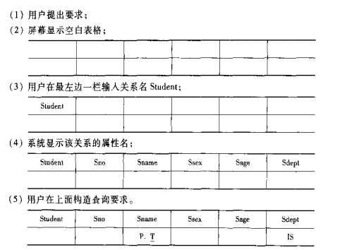
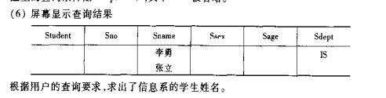

```{r setup, echo=F, purl=F}
knitr::opts_knit$set(root.dir = getwd())
knitr::opts_chunk$set(echo = TRUE, results = 'hide')
knitr::opts_chunk$set(warning = FALSE, message=FALSE)
knitr::opts_chunk$set(fig.align="center"
                      ## ,out.width="0.9\\textwidth" # latex
                      ,out.width="60%" # for both latex and html
                      ,fig.width=5, fig.height=3
                      )
```

```{r prepare, echo=F, purl=F}
rm(list=ls())
options(digits=4)
options(scipen=100)
graphics.off()
Sys.setlocale("LC_ALL", "Chinese")
```

# 关系数据库
## 关系数据结构及形式化定义
### 关系

1. 域
   
   **域**是一组具有相同数据类型的值得集合。例如整数、实数、长度小于25字节的字符
   串集合、{0， 1}等。

2. 笛卡尔积
   
   给定一组域$D_1$,$D_2$,$D_3$,...,$D_n$,这些域中可以是相同的域。$D_1$,$D_2$,$D_3$,...,$D_n$的**笛卡尔积**为：
   $$D_{1}\times D_{2}\times \cdots \times D_{n}=\left \{  \right (d_1,d_2,\cdots, d_n)|d_j\in D_j, i=1, 2, \cdots,n\}$$
   其中每一个元素叫做一个**n元组**或简称**元组**。
   元素中每一个值$d_i$叫做一个**分量**。
   若$D_i(i=1,2,...,n)$为有限集，其基数为$m_i(i=1,2,...,n)$，则的基数M为：
   $$M=\prod_{i=1}^{n}m_i$$
   笛卡尔积可表示为一个二维表，表中的每行对应一个元组，表中的每列对于一个域.

3. 关系
   - 关系：$D_{1}\times D_{2}\times \cdots \times D_{n}$的子集叫做在域$D_1$,$D_2$,$D_3$,...,$D_n$上的关系，表示为$R(D_1,D_2,\cdots ,D_n)$。这里的R代表关系名，n是关系的**目或度**
   - 元组： 关系中的每个元素是关系中的元组，通常用t表示。
   - 单元关系与二元关系：当n=1时，称该关系为单元关系，当n=2时，称该关系为二元关系
   - 属性：每列的名字，称为属性，n目关系必有n个属性
   - 码：若关系中的某一属性组的值能唯一地标识一个元组，则称该属性组为候选码；若一个关系有多个候选码，则选定其中一个为主码

### 关系模式

1. 什么是关系模式
   
  关系模式是型，关系是值，关系模式是对关系的描述。

2. 定义关系模式
   
  关系模式可以形式化的表示为：R（U, D, DOM, F)，其中R为关系名，U为组成该关系的属性名集合
   D为属性组U中属性所来自的域，DOM为属性向域的映象集合，F为属性间的数据依赖关系
   集合。
  关系模式通常简记为R(U)

3. 关系模式与关系
   
   关系模式是静态的、稳定的。关系是关系模式在某一时刻的状态或内容，是动态的、随时间不断变化的。

### 关系数据库

在一个给定的应用领域中，所有关系的集合构成一个关系数据库

关系数据库的型：关系数据库模式，对关系数据库的描述。

关系数据库的值: 关系模式在某一时刻对应的关系的集合，简称为关系数据库

## 关系操作

### 基本关系操作

- 常用的关系操作
    - 查询：选择、投影、连接、除、并、交、差
    - 数据更新：插入、删除、修改
    - 查询的表达能力是其中最主要的部分
    - 选择、投影、并、差、笛卡尔基是5种基本操作

- 关系操作的特点
    - 集合操作方式：操作的对象和结果都是集合，一次一集合的方式

### 关系数据库语言的分类

- 关系代数语言
    - 用对关系的运算来表达查询要求
    - 代表：ISBL
- 关系演算语言：用谓词来表达查询要求
    - 元组关系演算语言
        - 谓词变元的基本对象是元组变量
        - 代表：APLHA, QUEL
    - 域关系演算语言    
        - 谓词变元的基本对象是域变量
        - 代表：QBE
- 具有关系代数和关系演算双重特点的语言
    - 代表：SQL（Structured Query Language） 

## 关系的完整性

### 关系的三类完整性
实体完整性和参照完整性：

关系模型必须满足的完整性约束条件称为关系的两个不变性，应该由关系系统自动支持。

用户定义的完整性：
应用领域需要遵循的约束条件，体现了具体领域中的语义约束。
  
### 实体完整性
规则2.1 实体完整性约束(Entity Integrity)
若属性集A是基本关系R的主属性，则属性集A不能取空值,例：

SAP(SUPERVISON,SPECIALITY,POSTGRADUATE)

POSTGRADUATE：

主码（假设研究生不会重名),不能取空值

实体完整性规则的说明

* 实体完整性规则是针对基本关系而言的。一个基本表通常对应现实世界的一个实体集。
* 现实世界中的实体是可区分的，即它们具有某种唯一性标识。
* 关系模型中以主码作为唯一性标识。
* 主码中的属性即主属性不能取空值。
  主属性取空值，就说明存在某个不可标识的实体，即存在不可区分的实体，这与第2点相矛盾，因此这个规则成为实体完整性。

### 参照完整性
* 关系间的引用
* 外码
* 参照完整性规则

#### 关系间的引用
在关系模型中实体及实体间的联系都是用关系来描述的，因此可能存在着关系与关系间的引
用。

例1 

学术实体、专业实体

- 学生(学号，姓名，性别，专业号，年龄)
- 专业(专业号，专业名)
  
* 学生关系引用了专业关系的主码“专业号”。
* 学生关系中的“专业号”值必须是确实存在的专业的专业号 ，即专业关系中有该专业的记录。
  
例2 

学生、课程、学生与课程之间的多对多联系

- 学生(**学号**，姓名，性别，专业号，年龄)
- 课程（**课程号**，课程名，学分）
- 选修（**学号**，**课程号**，成绩）
  
例3

学生实体及其内部的一对多联系
- 学生（学号，姓名，性别，专业号，年龄，**班长**）
  

|学号|姓名|性别|专业号|年龄|班长|
|:---|:---:|:---:|:---:|:---:|:---:|
|801 |张三 |女|01|19|802|
|802 |李四 |男|01|20|   |
|803 |王五 |男|01|20|802|
|804 |赵六 |女|02|20|805|
|805 |钱七 |男|02|19|   |


* '学号'是主码，'班长'是外码，它引用了本关系的'学号'
* '班长'必须是确实存在的学生的学号

#### 外码

设F是基本关系R的一个或一组属性，但不是关系R的码。如果F与基本关系S的主码Ks相对应，则称F是基本关系R的外码

* 基本关系R称为参照关系(Referencing Relation)
* 基本关系S称为被参照关系(Referenced Relation)或目标关系(Target Relation)

例1：学生关系的'专业号'与专业关系的主码'专业号'相对应

* '专业号'属性是学生关系的外码
* 专业关系是被参照关系，学生关系为参照关系
  
例2 选修关系的'学号'与学生关系的主码'学号'相对应，选修关系的“课程号”与课程关系的主码“课程号”相对应

* '学号'与'课程号'是选修关系的外码
* 学生关系和课程关系均为被参照关系
* 选修关系为参照关系
  
例3: '班长'与本身的主码'学号'相对应

* '班长'是外码
* 学生关系既是参照关系也是被参照关系

- 关系R和S不一定是不同的关系
- 目标关系S的主码$K_s$ 和参照关系的外码F必须定义在同一个(或一组)域上
- 外码并不一定要与相应的主码同名
  
  当外码与相应的主码属于不同关系时，往往取相同的名字，以便于识别

#### 参照完整性规则

规则2.2 参照完整性规则

若属性(或属性组)F是基本关系R的外码，它与基本关系S的主码$K_s$相对应(基本关系R和S不一定是不同的关系),则对于R中每个元组在F上的值必须为:

或者取空值(F的每个属性值均为空值)
或者等于S中每个元组的主码值

例1：学生关系中每个元组的'专业号'属性只取两类值:

* 空值，表示尚未给学生分配专业
* 非空值，这时该值必须是专业关系中某个元组的'专业号'值，表示该学生不可能分配一个不存在的专业

例2: 选修(**学号**，**课程号**，成绩)，'学号'和'课程号'可能的取值：

* 选修关系中的主属性，不能取空值
* 只能取相应被参照关系中已经存在的主码值

例3：学生（学号，姓名，性别，专业号，年龄，班长）
 “班长”属性值可以取两类值：

* 空值，表示该学生所在班级尚未选出班长
* 非空值，该值必须是本关系中某个元组的学号值

### 用户定义的完整性

* 针对某一具体关系数据库的约束条件，反映某一具体应用所涉及的数据必须满足的语义要求。
* 关系模型应提供定义和检验这类完整性的机制，以便用统一的系统的方法处理它们，而不要由应用程序承担这一功能
  
例: 课程(课程号,课程名,学分)

* '课程号'属性必须取唯一值
* 非主属性'课程名'也不能取空值
* '学分'属性只能取值{1,2,3,4}


## 关系代数
### 概述
关系代数是一种抽象的查询语言，它是用对关系的运算来表达查询的。

关系代数的运算对象是关系，运算结果也是关系。关系代数用到的运算符如下：

| 运算符      | 含义                      |
|----------|-------------------------|
| 集合运算符    | ∪（并）、-（差）、∩（交）、x（笛卡尔积） |
| 比较运算符    | ＞ ≥ ＜ ≤ ＝ <>            |
| 专门的关系运算符 | $\delta （选择）、\pi（投影)、\infty (连接)、\div (除)$       |
| 逻辑运算符    | $\urcorner$（非）、$\wedge$(与)、$\wedge$(或)                   |


### 传统运算符
设R和S具有相同的目n（两个关系都有n个属性），且相应的属性取自同一个域。

1. **并（Union）**

$R\cup S:$

 $$R\cup S=\{t|t\in R \vee t\in S\}$$
结果仍为n目关系，由属于R或属于S的元组组成

2. **差（Difference）**

$R-S:$

 $$R-S=\{t|t\in R \wedge t\notin S\}$$
结果仍为n目关系，由属于R而不属于S的所有元组组成


3. **交（Intersection）**

$R\cap S:$

 $$R\cap S=\{t|t\in R \wedge t\in S\}\\
 R\cap S=R-(R-S)$$

结果仍为n目关系，由既属于R又属于S的元组组成

4. **(广义）笛卡尔积（Cartesian Product）**

* R: n目关系，k1个元组
* S: m目关系，k2个元组

$R\times S$

* 列：（n+m）列元组的集合
    * 元组的前n列是关系R的一个元组
    * 后m列是关系S的一个元组
* 行：k1×k2个元组
    * $R \times S=\{\widehat{t_{r} t_{S}} | t_{r} \in R \wedge t_{S} \in S\}$

### 专门的运算关系
**记号**

1. $R,t\in R,t[A_i]$
   * 设关系模式为$R(A_1,A_2,\cdots,A_n)$,它的一个关系设为R
   * $t\in R$表示t是R的一个元组
   * $t[A_i]$则表示元组t中相应于属性Ai的一个分量

如:$t = (a1,b1,c1)\in R$, 是R的一个元组 ,$t[A_2]$ =(b1)

2. $A,t[A],\overline{A}$
    * 若$A=\{A_{i1},A_{i2},\cdots ,A_{ik}\}$，其中$A_{i1}，A_{i2},\cdots ,A_{ik}$是$A_1，A_2,\cdots ,A_n$中的一部分，则A称为属性列或属性组。
    * $t[A]=(t[A_{i1},t[A_{i2},\cdots , t[A_{ik}])$表示元组t在属性列A上诸分量的集合。
    * $\overline{A}$则表示$A_1，A_2,\cdots ,A_n$中去掉$A_{i1}，A_{i2},\cdots ,A_{ik}$后剩余的属性组。

3. $\widehat{t_{r} t_{S}}$,R为n目关系，S为m目关系,$t_{r}\in R,t_{s}\in S$
    * $\widehat{t_{r} t_{S}}$称为元组的连接。
    * $\widehat{t_{r} t_{S}}$是一个n + m列的元组，前n个分量为R中的一个n元组，后m个分量为S中的一个m元组。

如：$t_r= (a1,b1,c1)\in R,t_s= (a1,b1,c1)\in S,则\widehat{t_{r} t_{S}}=(a1,b1,c1, b1,c2,d1)$


4. $象集Z_x$
   
   给定一个关系R（X，Z），X和Z为属性组。当t[X] = x 时，x在R中的象集（Images
   Set）为：
   $$Z_x=\{t[Z]|t \in  R,t[X] = x\}$$
 它表示R中属性组X上值为x的诸元组在Z上分量的集合


如：

| $x\_1$ | $Z\_1$ |
|--------|--------|
| $x\_1$ | $Z\_2$ |
| $x\_1$ | $Z\_3$ |
| $x\_2$ | $Z\_2$ |
| $x\_2$ | $Z\_3$ |
| $x\_3$ | $Z\_1$ |
| $x\_3$ | $Z\_3$ |

- $x_1在R中的象集:Z_{x_1} ={Z_1，Z_2，Z_3}$
- $x_2在R中的象集:Z_{x_1} ={Z_2，Z_3}$
- $x_3在R中的象集:Z_{x_1} ={Z_1,Z_3}$


1. **选择（Selection）** 
   
- 选择又称为限制（Restriction）
- 选择运算符的含义：
    - 在关系R中选择满足给定条件的诸元组：$\sigma_F(R)=\{t|t\in R \wedge F(t)='真'\}$
    - F:选择条件，是一个逻辑表达式，基本形式为：$X_1 \theta Y_1$
- 选择运算是从关系R中选取使逻辑表达式F为真的元组，是从行的角度进行的运算

2. **投影（Projection）** 

- 投影运算符的含义:
    - 从R中选择出若干属性列组成新的关系$\pi_A(R)=\{t[A]|t\in R\}$,A：R中的属性列
- 投影操作主要是从列的角度进行运算
    - 但投影之后不仅取消了原关系中的某些列，而且还可能取消某些元组（避免重复行）

3. **连接（Join）** 

- 连接也称为$\theta$连接
- 连接运算的含义:
  从两个关系的笛卡尔积中选取属性间满足一定条件的元组$$R\bowtie
  S=\{\widehat{t_{r}t_{S}} | t_{r} \in R \wedge t_{S} \in S\wedge t_r[A]\theta t_s[B]\}$$
    - A和B：分别为R和S上度数相等且可比的属性组
    - $theta$:比较运算符 
- 连接运算从R和S的广义笛卡尔积R×S中选取（R关系）在A属性组上的值与（S关系）在B属性组上值满足比较关系θ的元组 
- 两类常用连接运算
    + 等值连接(equijoin):$theta$为“＝”的连接运算称为等值连接，从关系R与S的广义笛卡尔积中选取A、B属性值相等的那些元组，即等值连接为：$$R \underset{A=B}{\bowtie} S=\{\widehat{t_{r}t_{S}} | t_{r} \in R \wedge t_{S} \in S\wedge t_r[A]= t_s[B]\}$$
    + 自然连接（Natural join）:自然连接是一种特殊的等值连接,两个关系中进行比较的
      分量必须是相同的属性组,在结果中把重复的属性列去掉;R和S具有相同的属性组B
      $$R\bowtie S=\{\widehat{t_{r}t_{S}} | t_{r} \in R \wedge t_{S} \in
      S\wedge t_r[B]= t_s[B]\}$$
- 一般的连接操作是从行的角度进行运算。
    + 自然连接还需要取消重复列，所以是同时从行和列的角度进行运算。

**外连接**

如果把舍弃的元组也保存在结果关系中，而在其他属性上填空值(Null)，这种连接就叫做外连接（OUTER JOIN）。

**左外连接**

如果只把左边关系R中要舍弃的元组保留就叫做左外连接(LEFT OUTER JOIN或LEFT JOIN)

**右外连接**
****
如果只把右边关系S中要舍弃的元组保留就叫做右外连接(RIGHT OUTER JOIN或RIGHT JOIN)。 


1. **除（Division）** 
   
- 给定关系R (X，Y) 和S (Y，Z)，其中X，Y，Z为属性组。
- R中的Y与S中的Y可以有不同的属性名，但必须出自相同的域集。
- R与S的除运算得到一个新的关系P(X)，P是R中满足下列条件的元组在 X 属性列上的投影：$$R\div S=\{t_r[X]|t_{r} \in R \wedge \pi_{Y}(S)\subseteq Y_X \}\\Y_X:x在R中的象集，x=t_r[X]$$
- 除操作是同时从行和列角度进行运算

举例：

R:

| A  | B  | C  |
|----|----|----|
| a1 | b1 | c2 |
| a2 | b3 | c7 |
| a3 | b4 | c6 |
| a1 | b2 | c3 |
| a4 | b6 | c6 |
| a2 | b2 | c3 |
| a1 | b6 | c1 |

S:

| B  | C  | D  |
|----|----|----|
| b1 | c2 | d1 |
| b1 | c1 | d1 |
| b2 | c3 | d2 |

$R\div S$

| A  |
|----|
| a1 |

- 在关系R中，A可以取四个值{a1，a2，a3，a4}
    + a1的象集为 {(b1，c2)，(b2，c3)，(b2，c1)}
    + a2的象集为 {(b3，c7)，(b2，c3)}
    + a3的象集为 {(b4，c6)}
    + a4的象集为 {(b6，c6)}
- S在(B，C)上的投影为{(b1，c2)，(b2，c1)，(b2，c3) }
- 只有a1的象集包含了S在(B，C)属性组上的投影$R\div S ={a1}$

## 关系演算
### 元组关系演算语言ALPHA
#### 检所操作
ALPHA语言主要有GET,PUT,HOLD,UPDATE,DELETE,DROP6条语句，语句的基本格式是
操作语句 工作空间名（表达式）：操作条件
1. 检索操作（GET语句）
1.1 简单检索
GET 工作空间名 （表达式1）
例[1] 查询所有被选修的课程号码。
```{sql, eval=F}
GET W (SC.Cno)
```
例[2] 查询所有学生的数据。
```{sql, eval=F}
GET  W  (Student) 
```

1.2 限定的检索
格式：GET　工作空间名（表达式1）：操作条件
例[3] 查询信息系(IS)中年龄小于20岁的学生的学号和年龄
```{sql, eval=F}
GET W (Student.Sno,Student.Sage)
:Student.Sdept='IS'^Student.Sage<20
```

1.3 带排序的检索
格式 GET　工作空间名（表达式1）[：操作条件] DOWN/UP 表达式2
例[4] 查询计算机科学系(CS)学生的学号、年龄，结果按年龄降序排序
```{sql, eval=F}
GET W (Student.Sno,Student.Sage)
:Student.Sdept='CS' DOWN Student.Sage
```

1.4 带定额的检索
格式 工作空间名 （定额） （表达式1）
[: 操作条件] [DOWN/UP 表达式2]

例[5] 取出一个信息系学生的学号
```{sql, eval=F}
GET W(1) (Student.Sno)
:Student.Sdept='IS'
```
例[6] 查询信息系年龄最大的三个学生的学号及其年龄，结果按年龄降序排序
```{sql, eval=F}
GET W(3) (Student.Sno，Student.Sage)
: Student.Sdept='IS' DOWN Student.Sage
```

1.5 用元组变量的检索
  * 元组变量的含义
  表示可以在某一关系范围内变化
  * 元组变量的用途
    + 简化关系名：设一个较短名字的元组变量来代替较长的关系名。
    + 操作条件中使用量词时必须用元组变量。
  * 定义元组变量
    + 格式：RANGE 关系名 变量名
    + 一个关系可以设多个元组变量
例[7] 查询信息系学生的名字
```{sql, eval=F}
RANGE Student X
Get W(X.Sname) : X.Sdept = ‘IS’
```
1.6 全称量词
在语句中含有短语“所有”、“每一个”、“任何一个”、“任意一个”“一切”等都是在指定范围内，表示整体或全部的含义，这样的词叫作全称**量词**。
含有全称量词的命题叫作全称**命题**。全称量词的否定是存在量词。
全称命题：其公式为“所有S是P”。
“对所有的”、“对任意一个”等词在逻辑中被称为全称量词，记作“∀”，含有全称量词的命题叫做**全称命题**。
对M中任意的x，有p(x)成立，记作:∀x∈M，p(x)。
否定：对于含有一个量词的全称命题p：∀x∈M，p(x)的否定┐p是：∃x∈M，┐p(x)。

1.7 存在量词
  * 定义：:短语“有些”、“至少有一个”、“有一个”、“存在”等都有表示个别或一部分的含义，这样的词叫作存在量词，记作“∃” 。含有存在量词的命题叫作特称命题。特称命题 :其公式为“有的S是P”。

1.8 用存在量词的检索
  * 操作条件中使用量词时必须用元组变量 

例[8] 查询选修2号课程的学生名字。
```{sql, eval=F}
RANGE SC X
Get W(Student.Sname) : ∃ X(X.Sno = Student.Sno∧X.Cno='2')
```

[例9] 查询选修了这样课程的学生学号，其直接先行课是6号课程。
```{sql, eval=F}
RANGE Course  CX
GET W (SC.Sno) 
    : ∃CX (CX.Cno=SC.Cno ∧ CX.Pcno='6')
```

[例10] 查询至少选修一门其先行课为6号课程的学生名字
```{sql, eval=F}
RANGE Course CX
       SC     SCX
GET W (Student.Sname): ∃SCX (SCX.Sno=Student.Sno ∧ ∃CX (CX.Cno=SCX.Cno∧CX.Pcno='6')) 

```
前束范式形式： 
```{sql, eval=F}
GET W (Student.Sname)
    : ∃SCX∃CX (SCX.Sno=Student.Sno ∧ CX.Cno=SCX.Cno ∧ CX.Pcno='6')
```

1.9 带有多个关系的表达式的检索

[例11]  查询成绩为90分以上的学生名字与课程名字。
```{sql, eval=F}
RANGE SC SCX
GET W(Student.Sname，Course.Cname) :       
    ∃SCX (SCX.Grade≥90 ∧ 
          SCX.Sno=Student.Sno ∧
          Course.Cno=SCX.Cno)
```

1.10 用全称量词的检索

[例12]  查询不选1号课程的学生名字
```{sql, eval=F}
RANGE SC SCX
GET W (Student.Sname)
    :∀SCX (SCX.Sno≠Student.Sno∨SCX.Cno≠'1')
```
用存在量词表示:
```{sql, eval=F}
RANGE SC SCX
GET W (Student.Sname) 
   : ∃SCX (SCX.Sno=Student.Sno∧SCX.Cno='1')
```

1.11 用两种量词的检索

[例13]  查询选修了全部课程的学生姓名。
```{sql, eval=F}
RANGE Course CX
      SC     SCX
GET W (Student.Sname)
      : ∀CX ∃SCX (SCX.Sno=Student.Sno∧
                  SCX.Cno=CX.Cno)
```
1.12 用蕴函（Implication）的检索

[例14] 查询最少选修了200215122学生所选课程的学生学号
```{sql, eval=F}
RANGE Course CX
      SC     SCX
      SC     SCY
GET W (Student.Sno)
      : ∀CX(∃SCX (SCX.Sno==‘200215122'∧SCX.Cno=CX.Cno)
      /*或者推出*/∃SCY(SCY.Sno=Student.Sno ∧ SCY.Cno= CX.Cno))
```

1.13 聚集函数
常用聚集函数（Aggregation function）或内置函数（Build-in function）
|  函数名  |    功能    |
|  -----  | -----------|
|  COUNT  |    对元组计数    |
|  TOTAL  |    求总和    |
|  MAX  |    求最大值    |
|  MIN  |    求最小值    |
|  AVG  |   求平均值    |


[例15]  查询学生所在系的数目。
```{sql, eval=F}
GET W ( COUNT(Student.Sdept) )
```
[例16]  查询信息系学生的平均年龄
```{sql, eval=F}
GET W (AVG(Student.Sage): Student.dept='IS’  )

```

#### 更新操作
1. 修改操作
  * 用HOLD语句将要修改的元组从数据库中读到工作空间中
HOLD 工作空间名（表达式1）[：操作条件 ]
HOLD语句是带上并发控制的GET语句
  * 用宿主语言修改工作空间中元组的属性
  * 用UPDATE语句将修改后的元组送回数据库中
	  UPDATE 工作空间名

[例17]  把200215121学生从计算机科学系转到信息系。 
```{sql, eval=F}
HOLD W (Student.Sno，Student.Sdetp):
         Student.Sno=‘200215121'
MOVE 'IS' TO W.Sdept     
UPDATE W                
```

2. 插入操作
  * 用宿主语言在工作空间中建立新元组
  * 用PUT语句把该元组存入指定关系中
	   PUT 工作空间名 （关系名）
     PUT语句只对一个关系操作，关系演算中的聚集函数 

[例18]  学校新开设了一门2学分的课程“计算机组织与结构”，其课程号为8，直接先行课为6号课程。插入该课程元组
```{sql, eval=F}
MOVE '8' TO W.Cno
MOVE '计算机组织与结构' TO  W.Cname
MOVE '6' TO  W.Cpno
MOVE  '2' TO W.Ccredit
PUT  W  (Course)       
```

3. 删除操作
   * 用HOLD语句把要删除的元组从数据库中读到工作空间中
   * 用DELETE语句删除该元组
  		DELETE  工作空间名

[例19]  200215125学生因故退学，删除该学生元组
```{sql, eval=F}
HOLD W (Student) : Student.Sno=‘200215125'
DELETE  W 
```

[例20]  将学号200215121改为200215126
```{sql, eval=F}
HOLD W (Student): Student.Sno=‘200215121'
DELETE W
MOVE '200215126' TO  W.Sno
MOVE '李勇' TO  W.Sname
MOVE '男'  TO  W.Ssex
MOVE '20'  TO  W.Sage
MOVE 'CS'  TO  W.Sdept
PUT W (Student) 
```

[例21]  删除全部学生
```{sql, eval=F}
HOLD  W  (Student)
DELETE  W
```
为保证参照完整性 ，删除Student中元组时相应地要删除SC中的元组 
```{sql, eval=F}
HOLD  W  (SC)
DELETE  W          
```

### 域关系演算语言QBE
  * QBE：Query By Example
    + 基于屏幕表格的查询语言
    + 查询要求：以填写表格的方式构造查询
    + 用示例元素(域变量)来表示查询结果可能的情况
    + 查询结果：以表格形式显示

#### 检索操作
1. 简单查询
[例1]求信息系全体学生的姓名
```{r fig27,eval=T,echo=F,fig.cap="数据库系统的三位模式结构的一个实例",dev="png",results='markup',cache=F}

```
```{r fig28,eval=T,echo=F,fig.cap="数据库系统的三位模式结构的一个实例",dev="png",results='markup',cache=F}

```

2. 条件查询
[例] 求计算机科学系年龄大于19岁的学生的学号。
方法(1)：把两个条件写在同一行上

| Student | Sno | Sname | Ssex | Sage | Sdept |
|  -----  | --------- |------- | ---- | ---- | ---- |
|         | P.95001 | | | >19 | |

方法(2)：把两个条件写在不同行上，但使用相同的示例元素值
| Student | Sno | Sname | Ssex | Sage | Sdept |
|  -----  | --------- |------- | ---- | ---- | ---- |
|         | P.200215121 | | |  | CS |
|         | P.200215121 | | | >19 |  |

3. 聚集函数
常用聚集函数：

|  函数名  |    功能    |
|  -----  | -----------|
|  COUNT  |    对元组计数    |
|  TOTAL  |    求总和    |
|  MAX  |    求最大值    |
|  MIN  |    求最小值    |
|  AVG  |   求平均值    |

[例]  查询信息系学生的平均年龄。 

| Student | Sno | Sname | Ssex | Sage | Sdept |
|  -----  | --------- |------- | ---- | ---- | ---- |
|         |  | | | P.AVG.ALL | IS |

4. 对查询结果排序
   [例]  查全体男生的姓名，要求查询结果按所在系升序排序，对相同系的学生按年龄降
   序排序。

| Student | Sno | Sname | Ssex | Sage | Sdept |
|  -----  | --------- |------- | ---- | ---- | ---- |
|         |  | P.李勇 | 男 | DO(2) | AO(1) |

#### 更新操作
1. 修改操作
[例]  把200215121学生的年龄改为18岁。
方法(1) ：将操作符“U.”放在值上

| Student | Sno | Sname | Ssex | Sage | Sdept |
|  -----  | --------- |------- | ---- | ---- | ---- |
|         | 200215121 |  |  | U.18 |  |
方法(2)： 将操作符“U.”放在关系上
| Student | Sno | Sname | Ssex | Sage | Sdept |
|  -----  | --------- |------- | ---- | ---- | ---- |
|   U.      | 200215121 |  |  | 18 |  |

2. 插入操作
[例]  把信息系女生200215701，姓名张三，年龄17岁存入数据库中。

| Student | Sno | Sname | Ssex | Sage | Sdept |
|  -----  | --------- |------- | ---- | ---- | ---- |
|   I.      | 200215701 | 张三 | 女 | 17 | IS |
[例17]  删除学生200215089
| Student | Sno | Sname | Ssex | Sage | Sdept |
|  -----  | --------- |------- | ---- | ---- | ---- |
|   D.      | 200215701 |  |  |  |  |

## 小结
1. 关系数据库系统是目前使用最广泛的数据库系统 
2. 关系数据库系统与非关系数据库系统的区别：
  * 关系系统只有“表”这一种数据结构；
  * 非关系数据库系统还有其他数据结构，以及对这些数据结构的操作 
3. 关系数据结构
  * 关系
  * 关系模式
  * 关系数据库
4. 关系操作
  * 查询
    + 选择、投影、连接、除、并、交、差
  * 数据更新
    * 插入、删除、修改
5. 关系的完整性约束
  * 实体完整性
  * 参照完整性
  * 用户定义的完整性
6. 关系数据语言
  * 关系代数语言
  * 关系演算语言
    + 元组关系演算语言  ALPHA
    + 域关系演算语言      QBE
